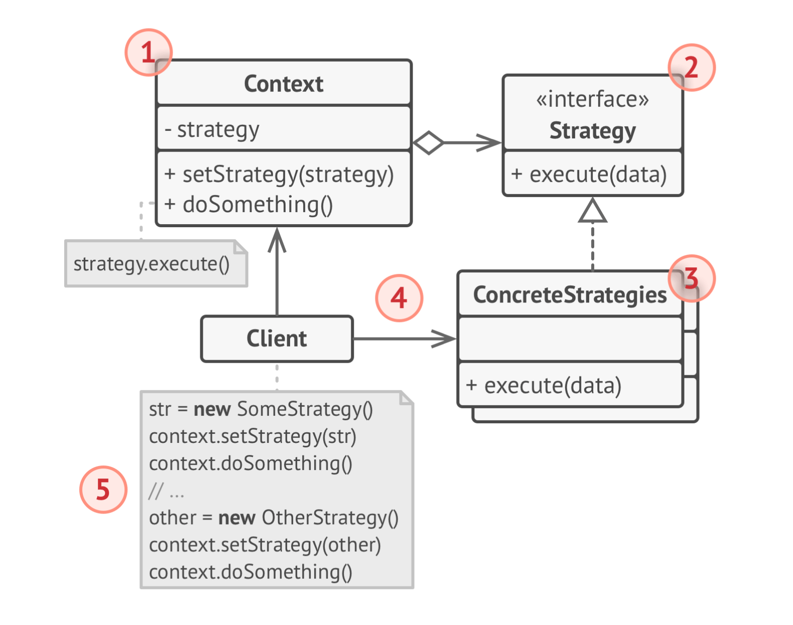
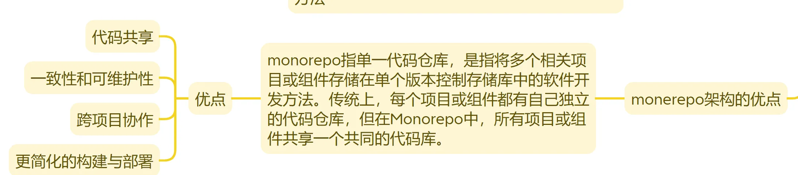

# AI对话平台万字长文解析

前端源码：

讲解视频：<https://www.youtube.com/playlist?list=PLjwm_8O3suyMMs7kfDD-p-yIhlmEgJkDj>

```
   Vue：[https://github.com/shenmj2002/llm](https://github.com/shenmj2002/llm)
```

分支：master

后端源码：<https://github.com/wjywy/AI-Chat-be>

分支：dev_wjy

这篇也整理了一些专题，可以 look look：

1. [大文件上传详解](https://www.yuque.com/u29297079/51-644/bimlee9pc3u8hb2g?singleDoc#%20《大文件上传详解》)
2. [怎么解决长列表的渲染问题](https://www.yuque.com/u29297079/51-644/baynrl4zitphsfsb?singleDoc#%20《怎么解决长列表的渲染问题》)
3. [如何处理 Vue 中的错误](https://www.yuque.com/u29297079/51-644/vsmvvxymt919xxsz?singleDoc#%20《如何处理Vue中的错误》)
4. [现代包管理工具方案](https://www.yuque.com/u29297079/51-644/afk9y3hfrcwco45e?singleDoc#%20《现代包管理工具方案》)
5. [JS 设计模式](https://www.yuque.com/u29297079/51-644/yghv62g8fky0o5mh?singleDoc#%20《JS设计模式》)
6. [Websocket 和 HTTP 的区别](https://www.yuque.com/u29297079/51-644/st25g3d8sm57wz8g?singleDoc#%20《Websocket和HTTP的区别》)
7. [SSE 详解](https://www.yuque.com/u29297079/51-644/whne2qocay03gi97?singleDoc#%20《SSE详解》)
8. [一些很那么常见的性能优化方案](https://www.yuque.com/u29297079/51-644/blq9gwexxgqgwni8?singleDoc#%20《一些很那么常见的性能优化手段》)
9. [Pinia最佳实践](https://www.yuque.com/u29297079/51-644/zvpe93gs4czskzav?singleDoc#)
10. [AI 部分概念与易考点解析](https://www.yuque.com/u29297079/51-644/twq6phwsovp66wyd?singleDoc#)

写完本项目之后，也得掌握下相关的 AI 相关的一些概念知识和一些常考点：[AI 部分概念与易考点解析](https://www.yuque.com/u29297079/51-644/twq6phwsovp66wyd?singleDoc#)

## 前端版本

### 基于 Vue 的AI聊天平台

**技术栈：**Vue 3 + TypeScript + Pinia + Tailwind CSS + Ant Design Vue + Qwen

**项目概述：**开发了基于 Vue 的AI聊天平台，实现与多模态 AI 模型的实时对话、文件上传处理和多语言支持等功能

1. **大文件分片上传与MD5校验：** 实现了高效的**大文件上传**机制，采用**文件分片**和**并发上传**机制显著提升大文件的 上传性能。使用 **SparkMD5** 库计算整个文件和每个分片的**哈希值**，保证文件上传的**完整性**。并在整个过程实现**断点续传**和上传**进度显示**，提升了用户体验
2. **基于SSE的实时AI对话：** 基于 **Server-Sent Events** 实现了与 LLM 的实时对话功能，使用`EventSourcePolyfill` 库，支持 **SSE** 的请求头配置，建立与后端的持久连接，接收 AI 实时生成的**流式数据**，并通过 `onmessage` 事件处理器实现**打字机效果**的文本显示
3. **基于 Pinia 的状态管理：** 使用 Pinia 实现高效的前端状态管理，创建多个独立上下游 store（会话store、聊天store、主题store、用户信息store等）分离关注点。通过 Pinia 的简洁API和响应式更新模式，实现了组件间的高效状态共享
4. **高性能聊天功能设计：** 针对**长对话**场景，实现了基于**虚拟滚动**的高性能聊天界面，只渲染可视区域内的消息组件，大幅减少了 **DOM 节点数量和内存占用**。同时实现**图片懒加载**、**防抖节流**处理，优化渲染性能和滚动流畅度
5. **多会话管理优化：**设计并实现基于 **Map** 数据结构的多会话管理界面，采用**策略模式**处理文本、图片、文件等多种消息类型的渲染逻辑。针对 AI 流式回复场景，实现了**增量更新**机制，封装 `addChunkMessage` 方法，对最后一条系统消息进行实时内容追加，避免整个消息列表的重新渲染
6. **可复用的通用组件：**通用能力的沉淀与封装， 例如权限控制组件以及错误处理组件，分别提供权限控制以及错误捕捉能力，提升项目的可读性与安全性
7. **前端工程化实践：**基于 **pnpm workspace **实现 **monerepo **多仓管理，集成 **ESLint** 和 **Prettier **统一代码风格，集成 **Husky **和 **commitlint **统一项目代码提交规范

### 为什么选择 Qwen 呢，有对其他 LLM 模型做调研吗

#### 结合 Vue 项目讲解

<!-- 详细代码版 -->

**详细版（结合当前 Vue 项目）**
这个问题建议从“可用性、可维护性、可替换性”回答，而不是只说模型名字。当前项目把模型配置放在设置 store 中，API 层只认统一协议，因此换模型不会影响页面组件。

**对应代码（含注释）**

```ts
// src/stores/settings.ts
import { defineStore } from "pinia";
import { ref } from "vue";

export const useSettingStore = defineStore(
  "llm-setting",
  () => {
    // 1) 把模型放到全局配置，避免组件里写死
    const settings = ref({
      model: "Qwen/Qwen2.5-72B-Instruct-128K",
      stream: true,
      apiKey: "",
    });
    return { settings };
  },
  {
    // 2) 刷新后保留用户选过的模型，降低切换成本
    persist: true,
  },
);

// src/utils/api.ts
export async function createChatCompletion(
  messages: Array<{ role: string; content: string }>,
) {
  const settingStore = useSettingStore();
  const payload = {
    // 3) 请求层动态读取模型，支持后续 A/B 或按场景路由
    model: settingStore.settings.model,
    messages,
    stream: settingStore.settings.stream,
  };
  return fetch("/chat/completions", {
    method: "POST",
    headers: { "Content-Type": "application/json" },
    body: JSON.stringify(payload),
  });
}
```

在 Vue 项目里，这个问题不要只回答“国内可用”，要强调“工程侧成本”。可按下面结构回答：

- 接入成本：在 `src/stores/settings.ts` 里把 `model` 做成可配置项，Qwen/DeepSeek/GLM 都走同一个 `createChatCompletion` 请求通道，替换模型不改业务组件。
- 体验成本：聊天页面（`src/views/Layout.vue`）默认走流式输出，Qwen 在中文问答、指令跟随上的稳定性会直接影响“首 token 时间”和连续输出体验。
- 运维成本：国内链路延迟和可用性更稳，用户在 Web 端不需要额外网络条件，降低售后与排障成本。
- 扩展策略：用设置面板暴露模型下拉，先做“同协议多模型”抽象，再按场景做路由（通用问答用低价模型，复杂推理切高质量模型）。

关于为什么使用 Qwen，其实我的原因很简单，就是因为是国内的，大家可以不用翻墙就使用我的项目。

### 大文件上传

如果将大文件一次性上传，会发生什么？想必都遇到过在一个大文件上传、转等操作时，由于要上传大量的数据，导致整个上传过程耗时漫长。而且如果这时候中断上传，后续又得重新进行上传，所有优化大文件上传，乃是业务开发中的一个重点，所以接下来我们将会探究一系列解决方案

### 切片上传

切片上传指的是将一个大文件，按照固定的切法划分为若干个小文件。首先我们需要了解，为什么需要切片上传？在实际使用场景下，ta 有如下几个好处：

```
- **避免大文件上传失败**：传统上传方式假如网络中断了，整个文件上传就失败了。而切片上传只需要上传失败的那一部分
- **支持多线程加速**：多个切片可以并行上传，提高速度
- **支持断点续传**：即使用户中断了，也可以从还未上传的部分继续上传
```

那接下来我们就来详细讲一讲切片上传的实现

#### 怎么切

##### 结合 Vue 项目讲解

<!-- 详细代码版 -->

**详细版（结合当前 Vue 项目）**
切片逻辑建议做成“纯函数 + composable + UI 状态”三层：纯函数只负责切片，composable 管流程，组件只展示进度，这样更容易测试和复用。

**对应代码（含注释）**

```ts
// composables/useChunkUpload.ts
import { ref } from "vue";

const CHUNK_SIZE = 2 * 1024 * 1024; // 2MB

// 纯函数：只做切片，便于单测
export function createFileChunks(file: File, chunkSize = CHUNK_SIZE) {
  const chunks: Blob[] = [];
  let start = 0;
  while (start < file.size) {
    // File.slice 返回 Blob，不会立即复制整份内存
    chunks.push(file.slice(start, start + chunkSize));
    start += chunkSize;
  }
  return chunks;
}

export function useChunkUpload() {
  // UI 只关心这几个状态
  const progress = ref(0);
  const uploading = ref(false);
  return { progress, uploading };
}
```

在 Vue 工程里可以把“切片”设计成纯函数 + 组合式状态管理，方便复用和测试：

- 纯函数层：`createFileChunks(file, chunkSize)` 只负责返回 `Blob[]`，不依赖组件状态，便于单测覆盖边界（空文件、非整除、超大文件）。
- 组件层：在上传组件里只维护 `progress/chunkList/uploading` 等 `ref` 状态，不把切片逻辑写进模板事件回调，避免组件过重。
- Store 层：把“当前上传任务 id、暂停/继续状态”放到 Pinia，页面切换后仍可恢复任务上下文。
- 性能层：大文件切片 + MD5 计算建议放 Web Worker，主线程只负责 UI 响应（进度条、取消按钮）。

首先就是切片，这里我们使用 File 对象自带的 slice 方法进行切片：

```jsx
// 将文件切片
const createFileChunks = (file: File, chunkSize = CHUNK_SIZE) => {
  const chunks = [];
  let cur = 0;
  while (cur < file.size) {
    chunks.push(file.slice(cur, cur + chunkSize));
    cur += chunkSize;
  }
  return chunks;
};
```

但是文件的 slice 与数组的 slice 的差异还是挺大的。使用 `File.prototype.slice` 进行切片后，返回的是一个 `blob` 类型的数据，也就是说，这里 return 的 chunks，其类型是 `blob[]`。可能有很多同学只见过 Blob，但是对这个数据类型的具体含义却很陌生，所以这里详细讲一讲：Blob 是 Javascript 中用于表示不可变的原始二进制数据的对象，简单理解的话就是一段二进制数据的容器，里面可以存储任意内容，比如文本、图片、PDF、Word 文件等。

还可以扩展继续讲一讲，一般支持文件上传的系统，都会有一个支持文件下载的功能，那么这个功能是怎么实现的呢，没错，也是利用的 Blob。当我们点击下载按钮时，后端给我们返回的，就是一段 Blob 数据，然后我们就可以创建 Blob URL 再去创建 a 标签从而去触发浏览器快速下载 Blob

```jsx
const url = URL.createObjectURL(blob);
const link = document.createElement("a");
link.href = url;
link.download = "test.txt";
link.click();
```

#### 怎么传

##### 结合 Vue 项目讲解

<!-- 详细代码版 -->

**详细版（结合当前 Vue 项目）**
上传阶段不要直接 `Promise.all(全部切片)`，要做并发池、失败重试和进度回写。组件只触发上传动作，实际上传放到 service/composable。

**对应代码（含注释）**

```ts
// api/upload.ts
type ChunkTask = () => Promise<void>;

async function runWithPool(tasks: ChunkTask[], limit = 4) {
  const ret: Promise<void>[] = [];
  const pool: Promise<void>[] = [];

  for (const task of tasks) {
    const p = task();
    ret.push(p);
    // 并发限制：池子满了就等待最先完成的任务
    if (limit <= tasks.length) {
      const e = p.finally(() => pool.splice(pool.indexOf(e), 1));
      pool.push(e);
      if (pool.length >= limit) await Promise.race(pool);
    }
  }
  await Promise.all(ret);
}

export async function uploadChunks(
  file: File,
  chunks: Blob[],
  onProgress: (v: number) => void,
) {
  let done = 0;
  const tasks = chunks.map((chunk, index) => async () => {
    const form = new FormData();
    form.append("chunk", chunk);
    form.append("index", String(index)); // 后端按 index 合并
    form.append("fileName", file.name);
    await fetch("/upload", { method: "POST", body: form });
    done += 1;
    onProgress(Math.round((done / chunks.length) * 100)); // 回写 UI 进度
  });
  await runWithPool(tasks, 4);
}
```

结合 Vue 项目，上传链路建议拆成“任务队列 + 请求器 + 进度同步”：

- 任务队列：把每个切片封装为任务对象 `{index, blob, retry, status}`，用并发池控制同时上传数（3~6 个更稳）。
- 请求器：统一收口到 `api/upload.ts`，和 `src/utils/api.ts` 一样做异常封装，组件只关心成功/失败和进度。
- 进度同步：每个切片完成后更新 Pinia 中的 `uploadedCount`，通过 `computed` 算总进度，Sidebar 或消息区都能订阅显示。
- 容错：单片失败重试，超过阈值再标记任务失败；不要让 `Promise.all` 一次失败导致全任务短路。

在切完之后，我们就需要将文件依次上传了，代码如下，就是比较简单的上传过程，需要注意的是，在上传过程中需要上传索引，以便后端进行文件的合并：

```jsx
// 上传切片
const uploadChunk = (chunk: Blob, index: number, fileName: string) => {
  const formData = new FormData();
  formData.append("chunk", chunk);
  formData.append("index", index.toString());
  formData.append("fileName", fileName);

  return fetch("http://localhost:3000/upload", {
    method: "POST",
    body: formData,
  }).then((response) => {
    if (!response.ok) {
      throw new Error(`切片 ${index} 上传失败`);
    }
    return response.json();
  });
};
```

但是又有个问题噢，如果说是一个十分巨大的文件，切片之后统计到文件共有两百份，那么这时你会选择使用 `promise.all(AllFile)`进行上传吗，这会带来什么问题呢

1. 首先，浏览器在 Http1.x 版本中，每个请求都需要一个独立的 TCP 连接，但是浏览器最多同时支持六个 TCP 连接，也就是说，最多同时并发六个请求。

那么，有同学可能又有疑惑——就算我使用 Promise.all 包裹所有的文件上传请求，但是浏览器不仍然同一时间只执行六个吗，这有什么关系呢，后续请求还是会排队进行请求呀。

是的，浏览器网络层确实会限制请求并发数，但是 JS 引擎并不会去进行限制。

举个简单的例子就是：比如你开了一个饭店（浏览器），门口一次只能让六个顾客进来（连接数），但是你让 1000 个人同时在门口排队登记填表抢椅子（创建请求对象、绑定事件、挂到事件循环），这时候哪怕饭店还没开始营业，但前厅就已经爆了。

也就是说，即使请求不会发出去，但这些 Promise 依然已经开始运行了，它们会去占用 JS 内存、异步调度队列以及 File/Blob 等资源，从而造成浏览器主线程或内存压力过大而崩溃

2. 也是一个比较主要的原因，`Promise.all`包裹之后，当某一个上传出错之后，会直接返回错误的结果，而不会去等其他文件上传的结果，容错太低

SO，这时候我们该怎么做呢？—— 使用并发池，也就是并发限制，我们会限制池子的最大上传数，当一个请求上传成功后，就会从池子外再扔一个请求到池子中，动态保持最大请求数的平衡。

`talk is easy，show me code`，并发池作为面试手撕经常被考到的一道题，还是很有必要看看是怎么实现的：

```jsx
function promiseAllLimit(tasks, maxConcurrency = 5, maxRetry = 3) {
  return new Promise((resolve, reject) => {
    const results = [];
    let index = 0; // 当前任务下标
    let activeCount = 0; // 当前正在执行的任务数量

    const retry = async (fn, retries) => {
      try {
        return await fn();
      } catch (err) {
        if (retries > 0) {
          retry(fn, retries--);
        } else {
          throw err;
        }
      }
    };

    function next() {
      if (index >= tasks.length && activeCount === 0) {
        return resolve(results); // 所有任务完成
      }

      while (activeCount < maxConcurrency && index < tasks.length) {
        const currentIndex = index;
        const task = tasks[currentIndex];
        index++;
        activeCount++;

        retry(task, maxRetry)
          .then((res) => {
            results[currentIndex] = res;
          })
          .catch((err) => {
            results[currentIndex] = err; // 最终失败也保留数据
          })
          .finally(() => {
            activeCount--;
            next(); // 继续处理下一个任务
          });
      }
    }

    next(); // 启动执行
  });
}
```

如上，我们就简单实现了一个 PromiseAllLimit 外加失败重试机制

#### 传完之后呢

##### 结合 Vue 项目讲解

<!-- 详细代码版 -->

**详细版（结合当前 Vue 项目）**
切片全部上传成功后，前端还要做“合并 + 校验 + 业务回填”。回填后把 `fileId` 绑定到当前会话消息，后续问答才能带着文件上下文。

**对应代码（含注释）**

```ts
// src/services/fileFlow.ts
import { useChatStore } from "@/stores/chat";

export async function finalizeUpload(fileName: string, totalChunks: number) {
  // 1) 通知后端合并
  const mergeRes = await fetch("/merge", {
    method: "POST",
    headers: { "Content-Type": "application/json" },
    body: JSON.stringify({ fileName, totalChunks }),
  }).then((r) => r.json());

  // 2) 校验合并结果是否可用（例如 hash 一致）
  if (!mergeRes.ok) throw new Error("文件合并失败");

  // 3) 把 fileId 记录到会话消息，供后续问答引用
  const chatStore = useChatStore();
  chatStore.addMessage({
    id: Date.now(),
    role: "assistant",
    content: `文件上传完成：${fileName}`,
    reasoning_content: "",
    files: [],
    speed: "",
    completion_tokens: "",
  });
}
```

在 Vue 项目里，“传完”不是结束，而是进入“校验 + 合并 + 回写业务”的闭环：

- 先调 `/merge` 合并切片，再调 `/verify`（或直接由 merge 返回校验结果）确认文件完整性。
- 前端收到成功后，把服务端 `fileId/fileUrl` 回填到当前会话消息（可复用 `chatStore.addMessage` 的 files 字段）。
- 若用于 RAG，对话发送时把 `fileId` 一并带给聊天接口，让模型在同一轮对话读取该文件上下文。
- UI 上给明确状态：上传中、合并中、可提问；失败时保留“重试合并”入口，不要直接清空任务。

传完之后当然是通知后端可以开始合并了！！

```jsx
// 通知服务器合并切片
const mergeChunks = (fileName: string, totalChunks: number) => {
  return fetch("http://localhost:3000/merge", {
    method: "POST",
    headers: {
      "Content-Type": "application/json",
    },
    body: JSON.stringify({
      fileName,
      totalChunks,
    }),
  }).then((response) => {
    if (!response.ok) {
      throw new Error("文件合并失败");
    }
    return response.json();
  });
};
```

在上传完毕后通过后端可以进行合并啦！

但是，你真的确保文件完整地被传输过去了吗？如果在传输过程中 TCP 断开连接或者数据包丢失或者被人为篡改，即使后端返回一切正常，但是并不能确保文件数据被完整无误地传输了过去。那我们应该怎么做呢，还记得在 [详谈 HTTPS ](about:blank)这篇文章我们怎么确保传输的内容不受篡改吗 —— 我们需要对每个文件切片做完整性校验，使用 md5 计算每个切片文件的哈希并传给后端，后端接受到哈希值和文件之后，也会对文件进行哈希，如果相等，则说明内容完整。同时，将整个文件的哈希值传给后端，也是为了实现秒传功能：上传服务器已有的文件时，可以做到一秒上传。

当然，如果你使用的 md5 且切片文件巨大，那么由于 md5 是同步对内容进行哈希处理，耗时时间长，又因为 JS 为单线程，所以就会引起程序阻塞。

那又该怎么处理呢，解决方法就是将 md5 的哈希计算放在 worker 线程中 —— 我们可以将一些耗时的同步操作放在 worker 线程中，以避免引起浏览器主线程的阻塞。同时将 worker 中的返回结果通过 PostMessage 传给主线程

### 断点续传

断点续传相对来说就简单很多了，只需要在重新上传时检查有哪些已经被上传过了文件切片就行啦：

```jsx
// 检查已上传的切片
const checkUploadedChunks = async (fileName: string, fileHash: string) => {
  try {
    const response = await fetch(
      `http://localhost:3000/check?fileName=${encodeURIComponent(
        fileName
      )}&fileHash=${fileHash}`,
      {
        method: "GET",
      }
    );

    if (!response.ok) {
      return [];
    }

    const data = await response.json();
    return data.uploadedChunks || [];
  } catch (error) {
    console.error("检查已上传切片失败:", error);
    return [];
  }
};
```

然后跳过已上传的文件切片，从未上传的切片开始上传就好了

## SSE

详情可以看我写的这篇文章：[SSE详解](https://www.yuque.com/u29297079/51-644/whne2qocay03gi97?singleDoc#)

### SSE 是什么，和 Websocket、HTTP 的区别是什么呢

#### 结合 Vue 项目讲解

<!-- 详细代码版 -->

**详细版（结合当前 Vue 项目）**
这个项目核心是“前端发起一次提问，模型持续返回文本流”，在这种单向流场景里 SSE 成本最低。需要双向实时协同时再上 WebSocket。

**对应代码（含注释）**

```ts
// 对比：非流式 HTTP（一次性返回）
async function requestOnce(payload: unknown) {
  const res = await fetch("/chat/completions", {
    method: "POST",
    headers: { "Content-Type": "application/json" },
    body: JSON.stringify({ ...payload, stream: false }),
  });
  return res.json(); // 一次性整包返回
}

// SSE：持续返回 token，逐步渲染
function requestStream(url: string, onToken: (s: string) => void) {
  const es = new EventSource(url);
  es.onmessage = (e) => {
    // 每次 data 都是增量内容
    onToken(e.data);
  };
  return es;
}
```

结合当前 Vue 聊天页，可把三者理解为三种“消息到达方式”：

- HTTP：一次请求一次响应，适合非流式模式（`stream=false`），`createChatCompletion` 拿到完整答案后一次性渲染。
- SSE：服务端持续推送 token，前端在 `onmessage` 里增量更新最后一条 assistant 消息，最适合 AI 打字机效果。
- WebSocket：双向长连接，适合协同编辑、多人在线状态；如果只是模型单向输出，SSE 语义更简单。
- 工程选择：本项目是“用户发问 -> 模型连续输出”，优先 SSE；只有强双向场景再引入 WebSocket。

#### HTTP（传统）

- HTTP1.x HTTP2.x
- 每次请求都新建连接，请求→响应后立即关闭
- 适合一次性获取数据，如网页、API 请求

#### SSE（Server-Sent Events）

- HTTP + text/event-stream，相当于就是持久连接的 HTTP 请求
- 浏览器用 `EventSource` 发起 GET 请求，建立持久连接
- 服务器通过该连接不断推送“事件文本流”
- 天然支持浏览器自动重连和事件标识（id、retry）
- 缺点：只能单向、不能自定义 headers（需 polyfill）、只能传文本

#### WebSocket

- 独立协议，建立于 HTTP 之上，通过 `Upgrade` 请求握手为 `ws://` 协议
- 建立后为**双向通信通道**，可同时读写
- 支持任意格式（JSON、二进制、ProtoBuf 等）
- 需要自己维护连接状态、重连、心跳等逻辑

### SSE 的原理是什么呢

#### 结合 Vue 项目讲解

<!-- 详细代码版 -->

**详细版（结合当前 Vue 项目）**
原理上是“HTTP 长连接 + 文本事件流”。Vue 里重点不是理解协议，而是把 `onmessage` 的每个 chunk 平滑写入 store，避免整列表重渲。

**对应代码（含注释）**

```ts
// src/services/sse.ts
import { useChatStore } from "@/stores/chat";

export function startSSE(url: string) {
  const chatStore = useChatStore();
  const source = new EventSource(url);

  source.onmessage = (event) => {
    // 1) 后端按 data: 推送文本片段
    const chunk = event.data;
    // 2) 只更新最后一条 assistant 消息
    const last = chatStore.getLastMessage();
    if (last?.role === "assistant") {
      chatStore.updateLastMessage(
        last.content + chunk,
        last.reasoning_content,
        last.completion_tokens || "",
        last.speed || "",
      );
    }
  };

  source.onerror = () => {
    // 3) 出错时主动关闭，避免重复连接
    source.close();
  };

  return source;
}
```

在 Vue 场景下，SSE 原理可落到“连接、分帧、渲染”三步：

- 连接：浏览器建立一个长连接，请求头声明 `text/event-stream`，后端不立即关闭。
- 分帧：后端按 `data:` 行持续输出片段；每到一段，前端回调触发一次。
- 渲染：页面不新增多条消息，而是调用类似 `updateLastMessage` 的方法，把内容追加到最后一条 assistant 消息。
- 结束：收到 `[DONE]` 或连接关闭时，更新 `isLoading=false`，恢复输入框可发送状态。

先简单的一句话概括： 客户端会建立一个持久的 HTTP 连接，服务器通过该连接持续不断地向客户端发送"事件流"数据。

> 这个连接是长连接，但不是 Websocket，而是标准 HTTP 长连接（HTTP1.1 的 keep-alive）

#### 通信流程

1. 首先，客户端会使用内置的 EventSource 发起一个 HTTP 请求
2. 服务端响应时设置`Content-type: text/event-stream`，保持连接不断开
3. 服务端不断向客户端推送文本格式的数据流（流式响应 ）
4. 客户端实时处理这些数据，触发事件监听器

#### 数据格式

在 SSE 中，其标准的数据格式如下：

```jsx
event: message;
id: 1234;
retry: 5000;
data: Hello;
data: World;
```

含义如下：

| 字段     | 含义                               |
| -------- | ---------------------------------- |
| `data:`  | 消息数据（支持多行）               |
| `event:` | 自定义事件类型（默认是 `message`） |
| `id:`    | 每个消息的唯一 ID（断线重连时用）  |
| `retry:` | 指定客户端重连间隔（毫秒）         |

#### 断线重连

客户端内置了自动重连机制，如果网络断线了，客户端会自动重试：

- 如果服务端发送了`id：`字段，那么客户端会记录最后一个事件 id
- 重新连接时会带上`Last-Event-ID`请求头，服务端可以使用这个 ID 恢复推送

### Websocket 和 HTTP 的主要区别是什么呢

#### 结合 Vue 项目讲解

<!-- 详细代码版 -->

**详细版（结合当前 Vue 项目）**
面试可以回答：HTTP 是请求驱动，WebSocket 是连接驱动。当前 AI 对话主要是模型输出，HTTP+SSE 已够用；WebSocket 会引入心跳、重连、鉴权续期等额外治理成本。

**对应代码（含注释）**

```ts
// WebSocket 需要你自己维护连接生命周期
function connectWS() {
  const ws = new WebSocket("wss://example.com/ws");
  ws.onopen = () => {
    // 连接建立后可双向收发
    ws.send(JSON.stringify({ type: "ping" }));
  };
  ws.onmessage = (evt) => {
    // 收到服务端主动推送
    console.log("ws message", evt.data);
  };
  ws.onclose = () => {
    // 生产环境通常要做指数退避重连
  };
  return ws;
}
```

结合 Vue 聊天项目，面试可从“连接生命周期”来讲：

- HTTP 是短连接模型，天然适配“请求-响应”；`fetch` 代码简单，适合普通接口。
- WebSocket 升级后保持长连接，服务端可主动推送；但心跳、重连、鉴权续期都要前端自己兜底。
- 当前项目如果只做大模型对话，HTTP + SSE 已覆盖主链路，复杂度明显低于 WebSocket 全链路治理。
- 若后续要做“多人同会话实时协作”，再新增 WebSocket 通道，并与现有聊天 store 解耦。

专题：[Websocket和HTTP的区别](https://www.yuque.com/u29297079/51-644/st25g3d8sm57wz8g?singleDoc#)

### 打字机效果的实现有哪些方案

#### 结合 Vue 项目讲解

<!-- 详细代码版 -->

**详细版（结合当前 Vue 项目）**
优先选真流式（SSE/chunk）实现打字机；如果后端不支持流式，再做前端伪流式。关键是“只修改最后一条消息”，不要在每个字符到来时重建整数组。

**对应代码（含注释）**

```ts
// 伪流式方案：把完整答案按字符吐给 UI（后备方案）
export async function typewriter(
  fullText: string,
  onChunk: (s: string) => void,
) {
  let i = 0;
  return new Promise<void>((resolve) => {
    const timer = setInterval(() => {
      // 每次推进一个字符，模拟模型流式输出
      onChunk(fullText.slice(0, i + 1));
      i += 1;
      if (i >= fullText.length) {
        clearInterval(timer); // 结束后释放定时器
        resolve();
      }
    }, 20);
  });
}
```

在 Vue 里可以分三层实现：

- 真流式：SSE/流式 fetch 每收到 chunk 就更新 `chatStore.updateLastMessage`，体验最好。
- 伪流式：后端返回整段文本后，前端 `setInterval/requestAnimationFrame` 逐字渲染，适合非流式模型。
- 混合方案：推理内容（reasoning）与最终回答分区域渲染，先快速给出主答案，再补全细节。
- 关键点：只更新最后一条消息，避免整个 `v-for` 列表重渲；并在组件卸载时及时终止流。

1. 通过 sse 方案，不间断接收并渲染后端返回的流式数据，自动实现打字机效果
2. 通过 setTimeout 方案，按照固定时间将数据渲染到页面上

### SSE 请求的流程可以详细讲一下吗

#### 结合 Vue 项目讲解

<!-- 详细代码版 -->

**详细版（结合当前 Vue 项目）**
可以按 4 层讲：`页面触发 -> 请求创建 -> 流式消费 -> 收尾回收`。这样回答既有工程视角，也能体现你对异常路径的处理能力。

**对应代码（含注释）**

```ts
// src/views/Layout.vue（伪代码）
async function handleSend(text: string) {
  const chatStore = useChatStore();
  // 1) 先写入用户消息
  chatStore.addMessage(messageHandle.formatMessage("user", text, "", []));
  // 2) 插入 assistant 占位，防止后续找不到目标消息
  chatStore.addMessage(messageHandle.formatMessage("assistant", "", "", []));
  chatStore.setIsLoading(true);

  // 3) 发起 SSE 并持续写入 chunk
  const source = startSSE(`/sse?q=${encodeURIComponent(text)}`);

  // 4) 在 done/error/route-leave 时都要关闭连接
  source.onerror = () => {
    chatStore.setIsLoading(false);
    source.close();
  };
}
```

可以直接按当前 Vue 工程分层描述：

- 入口层（`Layout.vue`）：用户发送后先写入 user 消息，再插入空 assistant 占位消息。
- Service 层（可对齐 `src/utils/api.ts`）：创建 SSE 请求并附带鉴权参数。
- 消费层：监听 `message` 事件，把 chunk 传给 `messageHandle`，再回调到 `chatStore.updateLastMessage`。
- 收尾层：`done/error/abort` 都要统一 `setIsLoading(false)`，并做重试或错误提示。

后端使用 Nest.js 开发，前端使用 Vue 开发，下面看看实际的应用开发

#### 客户端

在客户端中，发起 SSE 请求之前还需要先发送一个 PostMessage 请求，这个请求的作用如下：

1. 提交用户发送的消息
2. 服务端收到消息通过大模型生成流式回复后，通过 SSE 将回复响应式推送给客户端

发送 PostMessage 之后，就可以建立 SSE 请求并监听流式信息的返回了，其代码如下，需要注意的是，在每一次发送新的消息时，都需要手动关闭前一条信息建立的 SSE 响应，不然后续的请求会再次接收到之前信息的响应结果

```jsx
// API

// 发送消息
export const sendChatMessage = (data: SendMessageType): Promise<Data<object>> => {
  return request('chat/sendMessage', 'POST', data)
}

// 建立sse连接
export const createSSE = (chatId: string) => {
  const { token } = useUserStore.getState()
  return new EventSourcePolyfill(`${BASE_URL}/chat/getChat/${chatId}`, {
    headers: {
      Authorization: token || ''
    }
  })
}
```

```jsx
// 业务代码，一些变量的定义这里就省略了，可以看博主github上的源码
  const sendMessage = async (
    chatId: string,
    message: string,
    images?: string[],
    fileId?: string
  ) => {
    try {
      await sendChatMessage({
        id: chatId,
        message,
        imgUrl: images,
        fileId
      }).finally(() => {
        setSelectedImages([])
      })
    } catch (error) {
      console.log('发送消息失败', error)
      addMessage({
        content: [
          {
            type: 'text',
            content: '发送失败，请重试'
          }
        ],
        role: 'system'
      })
      setInputLoading(false)
    }
  }

  const createSSEAndSendMessage = (
    chatId: string,
    message: string,
    images?: string[],
    fileId?: string
  ) => {
    if (eventSourceRef.current) {
      eventSourceRef.current.close()
    }

    eventSourceRef.current = createSSE(chatId)
    // eslint-disable-next-line unused-imports/no-unused-vars
    let content = ''
    eventSourceRef.current.onmessage = (event) => {
      try {
        const data = JSON.parse(event.data)
        if (data.type === 'chunk') {
          content += data.content
          addChunkMessage(data.content)
        } else if (data.type === 'complete') {
          content = data.content
          setInputLoading(false)
          content = ''
        } else if (data.type === 'error') {
          console.error('SSE连接错误:', data.error)
        }
      } catch (error) {
        console.log('解析消息失败', error)
      }
    }

    eventSourceRef.current.onerror = (error) => {
      console.error('SSE连接错误:', error)
      eventSourceRef.current?.close()
      eventSourceRef.current = null
    }

    sendMessage(chatId, message, images, fileId)
  }
```

在上述 API 代码中，有一点也需要注意，为什么创建 SSE 请求的时候使用的是 `EventSourcePolyfill`而不是`EventSource`呢？

在真实的业务场景中，用户发起对话之时是会判断用户此时的登录状态的，如果尚未登录或者 token 时效过期，那么就需要重新登录之后才能发起对话。但是客户端内置的 `EventSource` 是不支持带上`request.header`的，那我们应该怎么解决呢：

1. 使用外部库：`EventSourcePolyfill`是一个支持 SSE 请求同时也支持带上请求头的解决方案，使用便捷，操作简单 ✅ （最佳方案）
2. 将 token 存放在 cookie 中，因为发送请求时 cookie 会自动被带到服务端
3. 将 token 放在 url 中以请求参数的形式发送给服务端，但是安全性差，容易导致 token 泄露。虽然感觉 token 泄露了也没什么大事，毕竟放在 LocalStorage 中 token 也会被获取到

#### 服务端

在 Nest.js 中，服务端设置就比较简单了，因为将 SSE 都已经封装好了：

cotroller 层主要有两个接口，SSE 与 SendMessage

```jsx
// controller层
  @Sse('getChat/:id')
  streamEvents(@Param('id') id: string): Observable<MessageEvent> {
    console.log('streamEvents', id);
    return this.chatService.getStreamEvents(id);
  }

  @Post('sendMessage')
  async sendMessage(@Body() sendMessageDto: SendMessageDto) {
    // 验证必要的参数
    if (!sendMessageDto.id || !sendMessageDto.message) {
      throw new HttpException(
        '缺少必要参数：chatId 或 message',
        HttpStatus.BAD_REQUEST,
      );
    }

    // 调用 service 方法处理消息并通过 SSE 发送响应
    await this.chatService.useGeminiToChat(sendMessageDto);

    return {
      msg: '消息已发送并开始处理',
      data: {},
    };
  }
```

service 层的实现逻辑主要分为三个函数，作用分别是：

1. `getStreamEvents`：找到对应的聊天主题，体现在客户端就是每一个新的聊天对话
2. `sendMessageToChat`：将响应信息通过 SSE 方式流式返回给客户端
3. `useGeminiToChat`：获取大模型的流式返回数据

没什么需要特别注意的点，将思路理清就行，使用了 RxJS 库

```jsx
// service层
  getStreamEvents(chatId: string): Observable<MessageEvent> {
    if (!this.chatSubjects.has(chatId)) {
      this.chatSubjects.set(chatId, new Subject<MessageEvent>());
    }

    const subject = this.chatSubjects.get(chatId);
    if (!subject) {
      throw new HttpException('找不到对应的聊天主题', HttpStatus.NOT_FOUND);
    }
    return subject.asObservable();
  }

  sendMessageToChat(chatId: string, message: any) {
    if (this.chatSubjects.has(chatId)) {
      const subject = this.chatSubjects.get(chatId);
      subject?.next(
        new MessageEvent('message', {
          // eslint-disable-next-line @typescript-eslint/no-unsafe-assignment
          data: message,
          lastEventId: String(Date.now()), // 对应 id
        }),
      );
    }
  }

 async useGeminiToChat({ id, message, imgUrl, fileId }: SendMessageDto) {
    try {
      const completion = await this.aiService.getMain(
        message,
        filePath,
        imgUrl,
      );

      let fullContent = '';
      for await (const chunk of completion) {
        if (Array.isArray(chunk.choices) && chunk.choices.length > 0) {
          const content = chunk.choices[0].delta.content || '';
          fullContent += content;

          // 通过SSE发送每个块到前端
          this.sendMessageToChat(id, {
            type: 'chunk',
            content: content,
            isComplete: false,
          });
        }
      }

      // 发送完整内容和完成标志
      this.sendMessageToChat(id, {
        type: 'complete',
        content: fullContent,
        isComplete: true,
      });

      await this.saveMessage(id, fullContent, MessageRole.SYSTEM); // 保存AI的响应到数据库

      this.logger.log(`聊天 ${id} 的完整响应已发送`);
    } catch (error) {
      this.logger.error(`聊天 ${id} 出错：${error}`);

      // 发送错误信息到前端
      this.sendMessageToChat(id, {
        type: 'error',
        content: `发生错误: ${error || '未知错误'}`,
        isComplete: true,
      });

      this.logger.log(
        '请参考文档：https://help.aliyun.com/zh/model-studio/developer-reference/error-code',
      );

      throw new HttpException(
        `聊天出错: ${error || '未知错误'}`,
        HttpStatus.INTERNAL_SERVER_ERROR,
      );
    }
  }
```

## 基于 Pinia 的状态管理

Pinia 最佳实践看我的这篇文章吧：

### Vue 中组件通信的方案有哪些

#### 结合 Vue 项目讲解

<!-- 详细代码版 -->

**详细版（结合当前 Vue 项目）**
这个项目里最常用三种：父子 `props/emit`、跨组件 Pinia、命令式 `ref + defineExpose`。回答时直接指到具体文件更有说服力。

**对应代码（含注释）**

```vue
<!-- src/views/Layout.vue -->
<ChatInput
  :loading="isLoading"
  @send="handleSend"  <!-- 子组件通过 emit 向父组件抛消息 -->
/>

<script setup lang="ts">
import { computed } from "vue"
import { useChatStore } from "@/stores/chat"

const chatStore = useChatStore()
// 跨组件共享：Sidebar/Message/Input 都读同一个 store
const isLoading = computed(() => chatStore.isLoading)
</script>
```

结合这个项目，通信方式可以这样落地：

- 父子 `props/emit`：`Layout.vue` 通过 `:loading` 传给 `ChatInput.vue`，`ChatInput` 用 `emit("send")` 抛出消息内容。
- 跨组件共享：会话与消息放到 Pinia（`src/stores/chat.ts`），Sidebar、消息区、输入区都能访问同一份状态。
- 命令式调用：设置抽屉与删除弹窗用 `ref + defineExpose`，父组件可直接 `openDrawer/openDialog`。
- 路由级通信：登录态、来源页通过路由守卫和 query 参数串联。

#### 父子组件通信（Props）

- **方式**：父组件通过 `props` 向子组件传递数据。
- **特点**：单向数据流（父 → 子）。

```vue
<!-- Parent.vue -->
<script setup>
import Child from "./Child.vue";
</script>

<template>
  <Child name="Vue" />
</template>

<!-- Child.vue -->
<script setup>
defineProps({
  name: String,
});
</script>

<template>
  <div>Hello, {{ name }}</div>
</template>
```

#### 子组件向父组件通信（Emit）

- **方式**：子组件通过 `emit` 触发事件，父组件监听该事件。
- **用途**：子组件向父组件“汇报”事件或数据。

```vue
<!-- Parent.vue -->
<script setup>
import Child from "./Child.vue";
const handleData = (data) => {
  console.log("Received from child:", data);
};
</script>

<template>
  <Child @send-data="handleData" />
</template>

<!-- Child.vue -->
<script setup>
const emit = defineEmits(["send-data"]);
</script>

<template>
  <button @click="emit('send-data', 'child data')">Send</button>
</template>
```

#### 兄弟组件通信（通过共同父组件）

- **方式**：兄弟组件共享一个父组件，由父组件协调状态和事件。
- **方法**：状态提升。

```vue
<!-- Parent.vue -->
<script setup>
import { ref } from "vue";
import SiblingA from "./SiblingA.vue";
import SiblingB from "./SiblingB.vue";

const value = ref("");
</script>

<template>
  <SiblingA @update-value="(v) => (value = v)" />
  <SiblingB :value="value" />
</template>
```

#### 跨层级通信（Provide / Inject）

- **方式**：父组件通过 `provide` 提供数据，子孙组件通过 `inject` 注入数据。
- **用途**：主题、用户信息、语言等需要多层传递的数据。

```vue
<!-- Provider组件 -->
<script setup>
import { provide, ref } from "vue";

const theme = ref("dark");
provide("themeContext", theme);
</script>

<!-- Inject组件 -->
<script setup>
import { inject } from "vue";

const theme = inject("themeContext");
</script>

<template>
  <div>Theme is {{ theme }}</div>
</template>
```

#### Ref 共享（defineExpose）

- **方式**：父组件通过 `ref` 直接调用子组件暴露的方法或属性。
- **为什么需要**：父组件需要主动“命令”子组件时，例如聚焦输入框或触发子组件动画。

**核心 API 拆解：**
在 `<script setup>` 中，组件默认是关闭的。必须使用 `defineExpose` 显式暴露属性或方法给父组件。

**完整示例：**

```vue
<!-- Child.vue -->
<script setup>
const alertMessage = () => alert("Hello from Child!");

defineExpose({
  alertMessage,
});
</script>
<template><div>我是子组件</div></template>

<!-- Parent.vue -->
<script setup>
import { ref } from "vue";
import Child from "./Child.vue";

const childRef = ref(null);

const handleCallChild = () => {
  // 通过 childRef.value 直接调用子组件暴露的方法
  childRef.value?.alertMessage();
};
</script>

<template>
  <Child ref="childRef" />
  <button @click="handleCallChild">点击调用子组件方法</button>
</template>
```

### Pinia 解决了哪些问题呢

#### 结合 Vue 项目讲解

<!-- 详细代码版 -->

**详细版（结合当前 Vue 项目）**
Pinia 解决的是“跨组件状态一致性”和“状态生命周期管理”。在聊天项目中，消息、会话、加载态如果分散在组件里，会很快失控。

**对应代码（含注释）**

```ts
// src/stores/chat.ts（节选）
export const useChatStore = defineStore(
  "llm-chat",
  () => {
    // 1) 全局会话列表，Sidebar 和消息区都依赖它
    const conversations = ref([
      { id: "1", title: "日常问候", messages: [], createdAt: Date.now() },
    ]);
    const currentConversationId = ref("1");

    // 2) 派生当前消息，不需要每个组件重复筛选
    const currentMessages = computed(() => {
      return (
        conversations.value.find((c) => c.id === currentConversationId.value)
          ?.messages || []
      );
    });

    // 3) Action 封装业务动作，组件只调用方法
    function addMessage(message: any) {
      const conv = conversations.value.find(
        (c) => c.id === currentConversationId.value,
      );
      if (conv) conv.messages.push(message);
    }

    return {
      conversations,
      currentConversationId,
      currentMessages,
      addMessage,
    };
  },
  { persist: true },
);
```

在该 Vue 聊天项目里，Pinia 主要解决三类问题：

- 状态分散：把会话列表、当前会话、消息流、加载状态集中在 `useChatStore`，避免多层 props 透传。
- 状态一致性：Sidebar 切换会话后，消息区自动切换 `currentMessages`，不会出现 UI 与数据错位。
- 持久化：`persist: true` 让会话和设置刷新后仍保留，符合聊天产品的连续使用习惯。
- 可维护性：业务动作（新建/删除/更新最后消息）都封装为 action，组件只发起意图不写复杂状态逻辑。

如果业务逻辑复杂，多个组件需要共享公共数据（例如：用户信息、聊天记录、主题设置等），采用传统的 Props 传递或 Provide/Inject 可能会导致“组件嵌套过深”或“状态管理松散”。

Pinia 的核心思想是将这些公共数据抽离到全局环境中，并且完全支持 Vue 的响应式系统，实现跨组件共享和修改数据。

### 结合项目讲解 Pinia 的应用

在本项目中，Pinia 主要承担了 **核心业务状态管理**：

#### 1. 聊天流式数据管理 (`useChatStore`)

由于 AI 对话是流式返回的（SSE），我们需要一个地方实时累加这些“碎片”字符，并通知 UI 刷新。

- **场景**：当后端传来一个 `chunk` 时，调用 `addChunkMessage`。
- **实现逻辑**：
  - 引入 `useConversationStore` 获取当前活跃的 `chatId`。
  - 在 `messages` 这个 Map 中找到对应对话，定位到最后一条 AI 消息，直接追加文本内容。
  - **优势**：逻辑高度封装在 Store 中，UI 组件只需通过 `useChatStore` 订阅消息并在页面渲染，不需要关心复杂的字符串拼接逻辑。

#### 2. 用户认证与持久化 (`useUserStore`)

登录状态（token、用户信息）需要全局共享，且在刷新页面后依然存在。

- **方案**：使用 Pinia 的 `pinia-plugin-persistedstate` 插件。
- **实现**：通过配置 `persist: true`，Pinia 会自动同步 `isAuthenticated`、`user` 和 `token` 到 `localStorage`。
- **优势**：无需手动编写 `localStorage.setItem`，代码更整洁且不容易出错。

#### 3. 跨 Store 联动

Pinia 允许在一个 Store 的 Action 中非常方便地引入并使用另一个 Store。

- **例子**：`useChatStore` 在保存消息时，会自动引入 `useConversationStore` 获取当前的 `selectedId`，实现了逻辑上的解耦。

### 有了解过 Pinia 的实现原理吗

#### 结合 Vue 项目讲解

<!-- 详细代码版 -->

**详细版（结合当前 Vue 项目）**
可以从“响应式 + store 单例 + 插件扩展”三点展开。核心不是背源码，而是解释为什么 `updateLastMessage` 改值后视图会精准刷新。

**对应代码（含注释）**

```ts
// 原理对应到业务代码的最小示例
import { defineStore } from "pinia";
import { ref, computed } from "vue";

export const useCounter = defineStore("counter", () => {
  const n = ref(0); // reactive 源状态
  const double = computed(() => n.value * 2); // 派生状态会自动追踪 n
  const inc = () => {
    n.value += 1;
  }; // action 修改状态触发依赖更新
  return { n, double, inc };
});

// 在任意组件里 useCounter() 拿到的是同一份 store（单例语义）
```

面试里建议结合项目代码讲“原理如何影响实践”：

- `defineStore` 本质是创建带响应式 state 的单例容器，组件拿到的是同一 store 实例。
- 依托 Vue reactivity，`computed(() => chatStore.currentMessages)` 会自动追踪依赖并精准更新。
- action 更新 state 时仍走 Vue 的响应式触发链，所以 `updateLastMessage` 改内容即可驱动界面刷新。
- 插件机制（如 persist）在 store 初始化时注入扩展能力，避免业务代码重复写本地存储逻辑。

具体的看我这篇文章，但是还在编写中呜呜：[Pinia原理解析](https://www.yuque.com/u29297079/51-644/lwdq93qxtyo8gs94?singleDoc#)

Pinia 是一个设计十分精妙的状态管理库，其原理依托于 Vue 的 reactivity API：

- Reactive API：基于 Vue 的 `reactive`/`ref` 实现状态的基础。
- 依赖注入（Provide/Inject）：Pinia 根实例被挂载在 Vue 应用的上下文中，任何组件都可以轻松获取所需的 store。
- 闭包与单例思想：每个 useStore 都会检查该 store 是否已经被初始化过，以此来保证同一个模块下的状态是单例共享的。

### 为什么要使用 Pinia 呢，有了解过其他状态管理方案吗

#### 结合 Vue 项目讲解

<!-- 详细代码版 -->

**详细版（结合当前 Vue 项目）**
回答建议突出“复杂度匹配”：聊天系统有多会话、流式输出、设置持久化，Pinia 在 TS 体验和维护成本上更平衡。

**对应代码（含注释）**

```ts
// 对比思路：如果不用 Pinia，父组件很快会出现 props drilling
type ChatState = {
  currentConversationId: string;
  messages: Array<{ role: "user" | "assistant"; content: string }>;
  isLoading: boolean;
};

// 使用 Pinia 后：组件只消费 store，不必层层传参
const chatStore = useChatStore();
chatStore.setIsLoading(true); // 由 action 统一修改
chatStore.updateLastMessage("新chunk", "", "", "");
```

结合此项目，选型依据可以回答为“成本-收益比”：

- 相比 Vuex，Pinia API 更轻，TypeScript 推导更顺滑，写聊天业务 action 更直接。
- 相比事件总线，Pinia 的状态来源单一，问题排查更可控，适合多会话与流式消息这种复杂状态。
- 相比只用组合式 API 局部状态，Pinia 更适合跨页面/跨组件共享（Sidebar 与消息区联动）。
- 迁移成本低：如果后续拆分模块（user/chat/settings），可以渐进式扩展而不推翻现有结构。

* Vuex

### 对比一下这些方案的优劣吧

专题编写 ing：[状态管理库调研对比](https://www.yuque.com/u29297079/51-644/kn95tczpan96c0kz?singleDoc#)

## 高性能聊天功能设计

### 虚拟滚动是怎么实现的，你这是不定高的吧，能详细讲讲不定高虚拟列表的实现方案吗

#### 结合 Vue 项目讲解

<!-- 详细代码版 -->

**详细版（结合当前 Vue 项目）**
不定高虚拟列表的关键是“先估算、后测量、再校正”。尤其在 AI 流式输出中，最后一条消息高度会不断变化，必须支持动态重算。

**对应代码（含注释）**

```ts
// 不定高核心算法（简化版）
function getVisibleRange(
  scrollTop: number,
  viewportHeight: number,
  count: number,
  heightMap: Map<number, number>,
  estimateHeight = 72,
) {
  let start = 0;
  let offset = 0;
  // 1) 用测量值优先，测不到用估算值
  while (
    start < count &&
    offset + (heightMap.get(start) ?? estimateHeight) < scrollTop
  ) {
    offset += heightMap.get(start) ?? estimateHeight;
    start++;
  }

  let end = start;
  let visibleHeight = 0;
  // 2) 继续累加直到覆盖可视区
  while (end < count && visibleHeight < viewportHeight) {
    visibleHeight += heightMap.get(end) ?? estimateHeight;
    end++;
  }
  return { start, end };
}
```

把它放到 Vue 聊天场景里，核心是“估算 + 测量 + 校正”：

- 初始用 `estimateHeight` 估算每条消息高度，通过前缀和快速算可视区范围。
- 渲染后用 `ref` 读取真实 `offsetHeight` 回写 `heightMap`，下一帧重新计算偏移。
- 对流式消息要特殊处理：最后一条 assistant 内容持续增长，需要动态复测该项高度。
- 配合 `overscan`（上下预渲染缓冲）减少滚动抖动，并避免频繁重排。

当页面需要一次性加载渲染大量数据（如海量历史聊天记录）时，采用全量渲染会导致 DOM 节点过多，使得页面的滚动与更新性能持续下降。因此，在本项目中，我选择了在**不引入第三方虚拟列表库的前提下，手写实现原生虚拟滚动**。

虚拟列表的核心原理是：**只渲染可视窗口内的元素，首尾补齐占位高度（padding），从而极大程度上减少 DOM 数量以提升渲染性能。**

#### listItem 定高实现思路

如果所有聊天消息高度固定，问题就很简单，主要依赖：

- 当前滚动位置 (`scrollTop`)
- 列表项的单项高度 (`itemHeight`)

通过 `Math.floor(scrollTop / itemHeight)` 就能得到当前应该渲染的起始 Index。再结合容器可视区域能容纳的元素个数，就可以算出结束区域。顶部占位区域即可设置为 `startIndex * itemHeight`。但这在包含长文本、Markdown、代码块、图片的聊天场景中是不适用的，因为实际高度必然是动态的。

#### listItem 不定高真机方案与核心难点

不定高的虚拟列表的难点主要在于：

1. **外部总容器的高度是不确定的。**
2. **无法简单通过 `scrollTop / itemHeight` 直接算出正确的初始渲染索引。**

对此，项目中的解决策略与工程亮点在于：**分离核心计算与 UI 组件，并使用 TDD（测试驱动开发）保障核心逻辑与边界覆盖**。

**核心算法实现（纯函数）：**
我们将区间计算抽象成一个不依赖 Vue 的纯函数 `calculateVirtualRange`。思路是：利用一个传入的 `heightMap` 保存真实渲染后测量出的元素高度，如果没有被测量过，则使用预估高度 `estimateHeight`。在每次重算时：

1. 构建一个累积高度数组 `offsets`，其中 `offsets[i+1] = offsets[i] + height`。
2. 依据 `scrollTop` 和 `viewportHeight`，在 `offsets` 中找到位于可视区域起始与结束范围的 Index。
3. 增加缓冲项（overscan，比如 3 个元素）来防止滚动临界时的白屏感。

```typescript
export const calculateVirtualRange = ({
  itemCount,
  scrollTop,
  viewportHeight,
  overscan,
  estimateHeight,
  heightMap,
}: VirtualRangeInput): VirtualRangeResult => {
  if (itemCount <= 0)
    return {
      startIndex: 0,
      endIndex: -1,
      paddingTop: 0,
      paddingBottom: 0,
      totalHeight: 0,
    };

  // 1. 根据 heightMap 和 estimateHeight 生成前缀高度和
  const offsets = new Array<number>(itemCount + 1);
  offsets[0] = 0;
  for (let i = 0; i < itemCount; i++) {
    const measured = heightMap?.get(i);
    const height = measured && measured > 0 ? measured : estimateHeight;
    offsets[i + 1] = offsets[i] + height;
  }
  const totalHeight = offsets[itemCount];

  // 2. 匹配可视区域的 start 和 end
  let start = 0;
  while (start < itemCount && offsets[start + 1] <= Math.max(0, scrollTop))
    start += 1;
  let end = start;
  while (
    end < itemCount &&
    offsets[end] < Math.max(0, scrollTop) + Math.max(0, viewportHeight)
  )
    end += 1;
  end = Math.max(start, end - 1);

  // 3. 应用 overscan 缓冲避免白屏
  const startIndex = Math.max(0, start - Math.max(0, overscan));
  const endIndex = Math.min(itemCount - 1, end + Math.max(0, overscan));

  return {
    startIndex,
    endIndex,
    paddingTop: offsets[startIndex],
    paddingBottom: totalHeight - offsets[endIndex + 1],
    totalHeight,
  };
};
```

**组件集成与动态测量：**
在 UI 组件层面，我们并不直接遍历这所有的几十万条数据，而是只渲染属于 `[startIndex, endIndex]` 范围的数据。我们将单项消息渲染出真实 DOM 后，使用 `ref` 获取其实际的 `offsetHeight`，如果高度发生了超过 1px 的变动，我们将其回填至 `heightMapRef` 中，并更新 `measureVersion` 触发 `useMemo` 重新进行区间计算。

```tsx
const ChatBubble = () => {
  const listRef = useRef<HTMLDivElement>(null);
  const heightMapRef = useRef<Map<number, number>>(new Map());
  const [measureVersion, setMeasureVersion] = useState(0);

  // 基于纯函数的 range 计算
  const virtualRange = useMemo(
    () =>
      calculateVirtualRange({
        itemCount: chatMessage.length,
        scrollTop,
        viewportHeight,
        overscan: 3,
        estimateHeight: 96,
        heightMap: heightMapRef.current,
      }),
    [chatMessage.length, scrollTop, viewportHeight, measureVersion],
  );

  // 测量并回写真实高度，设置容差阈值避免死循环
  const setMeasuredHeight = (index: number, node: HTMLDivElement | null) => {
    if (!node) return;
    const nextHeight = node.offsetHeight;
    const prevHeight = heightMapRef.current.get(index);
    if (!prevHeight || Math.abs(prevHeight - nextHeight) > 1) {
      heightMapRef.current.set(index, nextHeight);
      setMeasureVersion((version) => version + 1);
    }
  };

  return (
    <div ref={listRef} onScroll={handleScroll} style={{ overflowY: "auto" }}>
      {/* 顶部补齐占位 */}
      <div style={{ height: `${virtualRange.paddingTop}px` }} />
      {/* 仅按区间渲染 */}
      {visibleItems.map(({ index, message }) => (
        <div key={index} ref={(node) => setMeasuredHeight(index, node)}>
          <Bubble content={renderMessageContent(message.content)} />
        </div>
      ))}
      {/* 底部补齐占位 */}
      <div style={{ height: `${virtualRange.paddingBottom}px` }} />
    </div>
  );
};
```

**方案的收益与测试验证：**
在本项目中，我特意通过 **基准测试 (Benchmark)** 来量化优化效果：

- 在渲染 `10k~50k` 条深层次数据的场景下，**实际渲染条数可以从原先的全量渲染下降到稳定只需渲染十几条（DOM 节点减少达 99.9%）**。
- `calculateVirtualRange` 在进行 2000 次高频滚动更新模拟时，**每次区间计算的平均耗时大约只有 `0.14ms`**。

并且由于在编写功能前，我采用了 TDD（测试驱动开发）并编写失败测试，这也使得面对滚动场景和各种边界 `overscan` 计算时，拥有高度可信的自动化测试保障，这也是本项目相较于直接粘贴常规实现的一大亮点。

1. 第一步：图纸预估（先猜）
   在完全不确定每一条聊天记录有多高的情况下，我们写了一个纯函数

calculateVirtualRange
来干这个“猜”的活儿。

我们定义了一个数组叫 offsets，你可以把它当成一把尺子上的刻度，用来记录每条消息在页面上的 Y 轴位置。

typescript
// 传入的条件有：数据总数、滚动的距离、屏幕高度、预估高度(96)、小本本(heightMap)
export const calculateVirtualRange = ({
itemCount, scrollTop, viewportHeight, estimateHeight, heightMap
}) => {
// 制造成千上万条消息的“假坐标刻度”
const offsets = new Array(itemCount + 1)
offsets[0] = 0 // 第一条肯定在最顶部 0 的位置

for (let i = 0; i < itemCount; i++) {
// 【查小本本】：先去记账本(heightMap)里看看这条测过没有？
const measured = heightMap?.get(i)

    // 如果测过，就用真实的；如果没测过，就【瞎猜】默认高度 (96)
    const height = (measured && measured > 0) ? measured : estimateHeight

    // 下一条消息的位置 = 上一条的位置 + 当前的高度
    offsets[i + 1] = offsets[i] + height

}

// 这时候 offsets 把所有消息(即使还没渲染的)的上下位置都算出来了
// 然后我们只要根据滚动的距离，找找我们应该看哪几条 (省略找start和end的代码...)
return { startIndex, endIndex, paddingTop, paddingBottom }
}
【大白话解释】：这段代码的核心就是那个 for 循环。它在内存里把几万条消息的高度全加了一遍。聪明的点在于：它每次加的时候，都会先去问 heightMap：“这本书你量过真实厚度吗？量过我就用真实的，没量过我就暂时当它是 96px。”

2. 第二步：渲染并立刻拿尺子量（后测）
   算出了 startIndex 和 endIndex 后，组件

ChatBubble
开始真正把这几条消息画到屏幕上。

tsx
const ChatBubble = () => {
// 这是我们的记账小本本，用来存真实高度
const heightMapRef = useRef(new Map())

// 这是拿尺子量高度的函数！
const setMeasuredHeight = (index, node) => {
if (!node) return // 如果还没画出来就算了

    // node.offsetHeight 就是用尺子量出来的真实高度（比如 500px）
    const nextHeight = node.offsetHeight

    // 如果发现真实高度跟之前记的不一样
    if (Math.abs(heightMapRef.current.get(index) - nextHeight) > 1) {
      // 赶紧更新记账本！
      heightMapRef.current.set(index, nextHeight)
      // 告诉系统：有误差！重算！(这会触发上面的 calculateVirtualRange 重新跑一遍)
      setMeasureVersion((version) => version + 1)
    }

}
return (
// 我们只画从 start 到 end 的这十几条
{visibleItems.map(({ index, message }) => (
// 关键在这：画出来的瞬间，触发 setMeasuredHeight 拿尺子量

<div key={index} ref={(node) => setMeasuredHeight(index, node)}>
<Bubble content={message.content} />
</div>
))}
)
}
【大白话解释】：看视图渲染的 ref 部分，这就是我们的“间谍”。一旦真实的 Markdown 或者大图消息被浏览器渲染出来变成了真实的 DOM，ref 就会立刻拿到这个元素的实体 node，并且调用 node.offsetHeight 拿到铁打的真实像素。

3. 第三步：伪装没被渲染的元素（补足撑开滚动条）
   如果你只渲染视野里的十几条消息，那外面成千上万条消息都被抽空了，滚动条不就塌了吗？所以代码里还有最关键的上下占位（Padding）：

tsx

<div onScroll={handleScroll} style={{ overflowY: 'auto' }}>
    
      {/* 顶部占位：把上面所有没渲染的消息的总高度撑死！ */}
      <div style={{ height: `${virtualRange.paddingTop}px` }} />
      
      {/* 真实渲染的十几条可视消息 */}
      {visibleItems.map(...) }
      
      {/* 底部占位：把下面所有没渲染的消息的总高度也撑开！ */}
      <div style={{ height: `${virtualRange.paddingBottom}px` }} />
      
    </div>
【大白话解释】： virtualRange.paddingTop 是前面所有看不见的消息的高度总和。 不管你真实渲染了哪几条，只要我上面放一个这么高的空盒子撑着，下面放一个空盒子撑着，滚动条的长度看起来就像是几万条数据全都在那里一样，一丝一毫都不会乱挑。

总结串联（看代码时的心流）

calculateVirtualRange
每次执行都在算**“每条消息的 Y 轴坐标点”**（预估+真实混合）。
然后决定拿出 [start, end] 这十几条给 Vue 画。
Vue 一画完，ref 绑定的测量函数

setMeasuredHeight
立刻去量这十几条有多高。
量完发现和预估的不一样，存进 heightMap，并打个响指（让 measureVersion +1）。
整个组件一激灵，拿着更新后的真实高度回到第 1 步重算一遍坐标点！
如果面试官让你手撕或者讲解关键点，你只要把 heightMap?.get() 混合 estimateHeight 的前缀和累加，以及 ref 获取 offsetHeight 这两段代码解释清楚，就足够证明你对不定高虚拟列表完全精通了。

### 经典场景题之给你一万个列表，你该怎么渲染到页面上

#### 结合 Vue 项目讲解

<!-- 详细代码版 -->

**详细版（结合当前 Vue 项目）**
标准答案不是单点优化，而是组合拳：虚拟列表 + 分页拉取 + 空闲调度 + 稳定 key。面试时建议按“数据层、渲染层、调度层”讲。

**对应代码（含注释）**

```ts
// 调度层：把重活拆分到空闲时间，避免长任务卡输入框
function runInIdleQueue(jobs: Array<() => void>) {
  const loop = (deadline: IdleDeadline) => {
    while (deadline.timeRemaining() > 0 && jobs.length) {
      const job = jobs.shift()!;
      job(); // 每次只做一点工作
    }
    if (jobs.length) requestIdleCallback(loop);
  };
  requestIdleCallback(loop);
}
```

在 Vue 项目中，推荐“分层降压”方案：

- 渲染层：首选虚拟列表，仅挂载可见区节点。
- 调度层：超长计算用 `requestIdleCallback` 或分片 `setTimeout`，避免长任务阻塞输入。
- 数据层：分页/游标加载，滚动触底再增量拉取。
- 组件层：`v-memo`、稳定 `key`、拆分子组件，减少无关重渲。

这道题算是一道比较常见的经典题目了，其常见解决措施有如下几种：

```
1. setTimeout
2. Schduler.yield
3. requestanimation
```

这里具体措施先按下不表，如果想要了解的话可以看看这篇文章：[优化耗时较长的任务](https://web.dev/articles/optimize-long-tasks?utm_source=devtools&hl=zh-cn)；这里细致讲一下这三种方法的关系，做到融汇贯通才是最重要的

首先 setTimeout 和 Schduler.yield 的作用都是相同的：让程序可以跳出主线程，在下次页面渲染时再来执行，以便浏览器可以执行一些更重要的任务。

但是他两有一个细微区别：

- 当使用 setTimeout 将代码推迟到后续任务执行时，该任务会添加到任务队列的末尾。如果有其他任务正在等待，它们将在延迟执行的代码之前运行，就跟事件循环机制描述的相同。
- 在代码中插入`scheduler.yield()`<font style="color:rgb(32, 33, 36);">，该函数将在此时暂停执行并让出主线程。函数其余部分的执行（称为函数的</font>_<font style="color:rgb(32, 33, 36);">接续</font>_<font style="color:rgb(32, 33, 36);">）将安排在新的事件循环任务中运行。当该任务开始时，系统会解析所等待的 promise，然后函数会从上次停止的位置继续执行。</font>

requestAnimation 一般会用来跟 setTimeout 做比较：

```
- requestAnimation 需要传入一个回调函数作为参数，该回调函数会在下一次浏览器渲染之前执行，也就是说，其跟浏览器的刷新频率是同步的
- 而 setTimeout 的执行时间则较为依赖当前主线程是否空闲，也不会和浏览器渲染同步
- 所以，非 UI、偏逻辑、不需要和帧同步的任务，还是使用 setTimeout 较好。因为在下一帧之前即使你切到后台，代码依旧会照常运行。但如果你使用了 raf，并在里面放置逻辑代码，在下一帧之前切到后台去之后，raf 里面的代码就不会执行了
```

### 图片懒加载是怎么做的呢

#### 结合 Vue 项目讲解

<!-- 详细代码版 -->

**详细版（结合当前 Vue 项目）**
在聊天列表中，图片多且高度不固定，推荐 `IntersectionObserver`。进入可视区再设置真实 `src`，避免首屏请求风暴。

**对应代码（含注释）**

```ts
// directives/lazyImage.ts
import type { Directive } from "vue";

export const vLazyImage: Directive<HTMLImageElement, string> = {
  mounted(el, binding) {
    const io = new IntersectionObserver(
      (entries) => {
        const entry = entries[0];
        if (!entry?.isIntersecting) return;
        // 进入视口后再请求真实资源
        el.src = binding.value;
        io.disconnect(); // 只加载一次
      },
      { rootMargin: "200px" },
    ); // 提前 200px 预加载
    io.observe(el);
  },
};
```

在聊天项目里，懒加载通常与消息列表绑定：

- 用 `IntersectionObserver` 监听消息图片占位元素进入视口，再把 `data-src` 赋值给 `src`。
- 未进入视口前只渲染骨架图或低清图，减少首屏请求数量。
- 图片加载成功后缓存尺寸，避免消息气泡因图片回流导致滚动跳动。
- 列表复用时记得解绑观察器，防止内存泄漏。

大致有两种方案：

```
1. 给图片加上 lazy 属性，但是这种方式属于是浏览器新特性，不一定全部的浏览器都可以支持
2. 使用 JS 判断图片是否到达可视区域，当图片出现在可视区域时，用图片的`data-src`属性给图片的 `src`属性赋值
```

所以难点就是怎么判断图片有没有到达可视区域

#### 怎么判断元素有没有到达可视区域

##### 结合 Vue 项目讲解

<!-- 详细代码版 -->

**详细版（结合当前 Vue 项目）**
推荐优先 `IntersectionObserver`，手动计算作为降级方案。聊天容器常常不是 `window`，要记得指定 `root`。

**对应代码（含注释）**

```ts
// 手动兜底：用于不支持 IntersectionObserver 的环境
export function isInView(
  el: HTMLElement,
  container?: HTMLElement,
  preload = 0,
) {
  const rect = el.getBoundingClientRect();
  if (!container) {
    // window 视口判断
    return rect.top <= window.innerHeight + preload && rect.bottom >= -preload;
  }
  const c = container.getBoundingClientRect();
  // 自定义滚动容器判断
  return rect.top <= c.bottom + preload && rect.bottom >= c.top - preload;
}
```

在 Vue 里建议优先 `IntersectionObserver`，手动计算作为兜底：

- 推荐方案：`observer.observe(el)`，回调里读取 `entry.isIntersecting`。
- 兜底方案：`getBoundingClientRect().top < viewportHeight + preloadOffset`。
- 聊天列表要加预加载阈值（如 200px），避免用户滚动到图片时才开始请求导致白屏。
- 若容器不是 `window` 而是 `.messages-container`，需要把容器作为观察根节点。

方法也是有两种的：

```
1. 使用`IntersectionObserver`
2. 使用`scrollTop`进行高度判断：这个方法需要我们确认以下三个指标：
    * `window.innerHeight`：浏览器可视区域的高度
    * `document.body.scrollTop`：浏览器滚动了的距离，即浏览器可视区域顶部到文档顶部的距离
    * `imgs.offsetTop`：元素至文档顶部的距离
```

在知晓了上述三个指标的值之后，如果`imgs.offetTop < window.innerHeight + document.body.scrollTop`即在可视区域内。这里的指标跟无限加载利用滚动高度判断是否触底的场景的指标有些细微不同的，需要注意一下

### computed、watch、watchEffect 的区别

#### 结合 Vue 项目讲解

<!-- 详细代码版 -->

**详细版（结合当前 Vue 项目）**
一句话记忆：`computed` 产出值，`watch` 管副作用，`watchEffect` 快速试验。聊天页面滚底、网络请求、缓存同步这类副作用应优先用 `watch`。

**对应代码（含注释）**

```ts
import { computed, watch, watchEffect, nextTick } from "vue";
import { useChatStore } from "@/stores/chat";

const chatStore = useChatStore();
// 1) computed：派生状态，自动缓存
const currentMessages = computed(() => chatStore.currentMessages);

// 2) watch：精确监听 + 副作用（滚动到底）
watch(
  currentMessages,
  async () => {
    await nextTick(); // 等 DOM 更新完成再滚动
    const el = document.querySelector(
      ".messages-container",
    ) as HTMLElement | null;
    if (el) el.scrollTop = el.scrollHeight;
  },
  { deep: true },
);

// 3) watchEffect：自动收集依赖，适合轻量调试
watchEffect(() => {
  console.debug("message count:", currentMessages.value.length);
});
```

结合本项目可以这样落地记忆：

- `computed`：用于派生状态，如 `currentConversation/currentMessages`，强调“有缓存、可复用”。
- `watch`：用于副作用控制，如监听消息列表后 `nextTick` 滚到底，强调“可精确控制触发源和时机”。
- `watchEffect`：用于快速声明依赖自动追踪，适合原型阶段或依赖集合经常变化的场景。
- 经验：可计算就用 `computed`，涉及异步或 DOM 操作用 `watch`，减少不必要响应开销。

`computed`、`watch` 和 `watchEffect` 是 Vue 3 中响应式和性能优化的三个 API

#### computed

##### 作用：

**基于响应式依赖缓存一个计算值**，只有当依赖发生变化时才重新计算，有助于避免多次执行相同的复杂计算。

##### 语法：

```javascript
const count = ref(1);
const plusOne = computed(() => count.value + 1);
```

##### 用法场景：

- 模板中需要复杂的逻辑运算时；
- 只有当依赖数据变化时才重新计算的值。

#### watch

##### 作用：

**侦听一个或多个响应式数据源**，并在数据源变化时调用所给的回调函数。

##### 语法：

```javascript
const source = ref(0);
watch(source, (newValue, oldValue) => {
  console.log("数据变化了", newValue);
});
```

##### 用法场景：

- 在状态变化时执行异步操作；
- 需要对比数据变化前后的值进行特定逻辑处理。

#### watchEffect

##### 作用：

**立即执行并侦听其依赖**，在回调函数内部用到了哪些响应式数据，就会自动收集依赖，并在这些依赖变化时重新执行。

##### 语法：

```javascript
const count = ref(0);
watchEffect(() => {
  console.log("当前数量:", count.value);
});
```

##### 用法场景：

- 需要立即执行一次侦听器，同时自动追踪并响应依赖变化；
- 不需要知道数据变化前后的确切值，只关心最新状态。

### 防抖节流的场景

这个比较简单

防抖：一定时间内多次操作只执行最后一次

节流：一定时间内只执行一次操作

### 还有什么其他性能优化的方案吗

#### 结合 Vue 项目讲解

<!-- 详细代码版 -->

**详细版（结合当前 Vue 项目）**
除了虚拟滚动，还建议做“chunk 批处理提交、Markdown 缓存、组件懒加载、输入事件节流”。这样可以显著降低长会话下的主线程压力。

**对应代码（含注释）**

```ts
// 流式 chunk 批处理：把高频更新合并成按帧更新
let buffer = "";
let rafId = 0;

export function appendChunkByFrame(
  chunk: string,
  flush: (text: string) => void,
) {
  buffer += chunk; // 先写入缓冲区
  if (rafId) return; // 当前帧已注册，不重复注册
  rafId = requestAnimationFrame(() => {
    flush(buffer); // 每帧只提交一次，减少响应式触发次数
    buffer = "";
    rafId = 0;
  });
}
```

除了虚拟滚动和懒加载，这个 Vue 聊天项目还能继续做：

- 消息分块渲染：流式 chunk 先拼到缓冲区，按帧批量提交到 store，减少高频响应式触发。
- Markdown 解析缓存：对历史消息做 hash 缓存，避免每次切换会话重复解析。
- 资源级优化：图片/附件走 CDN 与压缩策略，首屏组件做按需加载。
- 交互级优化：输入框、滚动监听、resize 统一防抖节流。

直接看这篇文章：[一些很那么常见的性能优化手段](https://www.yuque.com/u29297079/51-644/blq9gwexxgqgwni8?singleDoc#)

## 多会话管理优化

### Map 数据结构的优势是什么，为什么要选用 Map

#### 结合 Vue 项目讲解

<!-- 详细代码版 -->

**详细版（结合当前 Vue 项目）**
会话管理里使用 Map 的优势在于：按 `conversationId` 做 O(1) 查询更新，比数组反复 `find` 更稳定。通常“Map 做索引，数组做展示顺序”。

**对应代码（含注释）**

```ts
type Conversation = { id: string; title: string };

// 1) 数组负责渲染顺序
const list: Conversation[] = [];
// 2) Map 负责快速索引
const byId = new Map<string, Conversation>();

function upsertConversation(c: Conversation) {
  if (!byId.has(c.id)) list.unshift(c); // 新会话插入展示列表
  byId.set(c.id, c); // O(1) 更新索引
}

function getConversation(id: string) {
  return byId.get(id); // O(1) 读取
}
```

结合多会话聊天，Map 的优势是“键稳定、语义清晰、性能可控”：

- 用会话 id 作为 key，`get/set/has/delete` 语义比对象更直观。
- 频繁切换会话时，Map 的查找和更新成本更稳定，适合大规模会话列表。
- 可与数组并存：数组负责排序展示，Map 负责 O(1) 访问与更新。
- 在 Vue 中可把 Map 作为 store 内部索引层，对外仍暴露数组，兼顾性能和模板可用性。

```
1. 性能更好，常规读写时间复杂度均是常数级别
2. 更丰富的方法，提供了直观且便捷的 API
3. 相较于 Object，不受原型链的影响
```

### Map 的读写的时间复杂度分别是多少

| 操作       | 方法                   | 时间复杂度 |
| ---------- | ---------------------- | ---------- |
| 插入（写） | `map.set(key, value)`  | **O(1)**   |
| 读取（查） | `map.get(key)`         | **O(1)**   |
| 删除       | `map.delete(key)`      | **O(1)**   |
| 是否存在   | `map.has(key)`         | **O(1)**   |
| 遍历       | `for...of`, `.forEach` | **O(n)**   |

`Map` 的实现底层通常使用**哈希表**（Hash Table），这使得在理想情况下插入、查找和删除操作都能在常数时间内完成

### 策略模式可以简单讲一讲吗

#### 结合 Vue 项目讲解

<!-- 详细代码版 -->

**详细版（结合当前 Vue 项目）**
在聊天系统里最典型是“按消息类型选择渲染/处理策略”。新增消息类型时只新增策略，不改主流程。

**对应代码（含注释）**

```ts
type Message = { type: "text" | "image" | "file"; content: string };
type Strategy = (m: Message) => string;

const strategyMap: Record<Message["type"], Strategy> = {
  text: (m) => m.content, // 文本直接输出
  image: (m) => ``, // 图片策略
  file: (m) => `[附件] ${m.content}`, // 文件策略
};

export function renderMessage(m: Message) {
  // 主流程不需要 if/else 链
  return strategyMap[m.type](m);
}
```

在 Vue 聊天项目里，策略模式最实用的点是“按消息类型拆渲染/处理逻辑”：

- 定义统一接口：`render(message)` 或 `transform(payload)`。
- 文本、图片、文件、系统通知分别实现策略，新增类型时只加新策略，不改主流程。
- 主上下文（如 `messageHandle`）只做策略选择与调度，避免巨型 if/else。
- 这能显著降低组件复杂度，提升多人协作时的可维护性。

策略模式建议找出负责用许多不同方式完成特定任务的类， 然后将其中的算法抽取到一组被称为策略的独立类中。

名为上下文的原始类必须包含一个成员变量来存储对于每种 策略的引用。 上下文并不执行任务， 而是将工作委派给已连 接的策略对象。

```
上下文不负责选择符合任务需要的算法——客户端会将所需 策略传递给上下文。 实际上， 上下文并不十分了解策略， 它 会通过同样的通用接口与所有策略进行交互， 而该接口只需 暴露一个方法来触发所选策略中封装的算法即可。
```

#### 结构



1. 上下文(Context)维护指向具体策略的引用，且仅通过策略 接口与该对象进行交流。
2. 策略(Strategy)接口是所有具体策略的通用接口，它声明了一个上下文用于执行策略的方法。
3. 具体策略(Concrete Strategies)实现了上下文所用算法的各种不同变体。
4. 当上下文需要运行算法时，它会在其已连接的策略对象上调用执行方法。上下文不清楚其所涉及的策略类型与算法的执 行方式。
5. 客户端(Client)会创建一个特定策略对象并将其传递给上下文。 上下文则会提供一个设置器以便客户端在运行时替换 相关联的策略。

#### 应用场景

**当你有许多仅在执行某些行为时略有不同的相似类时，可使用策略模式**。

策略模式让你能将不同行为抽取到一个独立类层次结构中，并将原始类组合成同一个，从而减少重复代码。

**如果算法在上下文的逻辑中不是特别重要，使用该模式能将类的业务逻辑与其算法实现细节隔离开来**。

策略模式让你能将各种算法的代码、 内部数据和依赖关系与 其他代码隔离开来。 不同客户端可通过一个简单接口执行算 法， 并能在运行时进行切换。

\*\*当类中使用了复杂条件运算符以在同一算法的不同变体中切 换时，可使用该模式。 \*\*

策略模式将所有继承自同样接口的算法抽取到独立类中， 因 此不再需要条件语句。 原始对象并不实现所有算法的变体， 而是将执行工作委派给其中的一个独立算法对象。

#### 实现方式

1. 从上下文类中找出修改频率较高的算法
2. 声明该算法所有变体的通用策略接口。
3. 将算法逐一抽取到各自的类中， 它们都必须实现策略接口。
4. 在上下文类中添加一个成员变量用于保存对于策略对象的引 用。 然后提供设置器以修改该成员变量。 上下文仅可通过策 略接口同策略对象进行交互， 如有需要还可定义一个接口来 让策略访问其数据。
5. 客户端必须将上下文类与相应策略进行关联， 使上下文可以预期的方式完成其主要工作。

#### 优缺点

**优点**

- 你可以在运行时切换对象内的算法。
- 你可以将算法的实现和使用算法的代码隔离开来。
- **开闭原则**。 你无需对上下文进行修改就能够引入新的策略。

**缺点**

- 如果你的算法极少发生改变， 那么没有任何理由引入新的类和接口。 使用该模式只会让程序过于复杂。
- 客户端必须知晓策略间的不同——它需要选择合适的策略。

#### 具体案例

绩效为S的人年终奖有4倍工资，绩效为A的人年终奖有3倍工资， 而绩效为B的人年终奖是2倍工资。假设财务部要求我们提供一段代码， 来方便他们计算员工的年终奖。

##### 计算奖金

```javascript
var strategies = {
  S: function (salary) {
    return salary * 4;
  },

  A: function (salary) {
    return salary * 3;
  },

  B: function (salary) {
    return salary * 2;
  },
};

var calculateBonus = function (level, salary) {
  return strategies[level](salary);
};
```

##### 表单校验

```javascript
type IsNotEmptyArg = { value: string }

type MobileFormatArg = { value: string }


const formStrategy = <const>{

  isNotEmpty: ({ value }: IsNotEmptyArg) => !isNullable(value),

  mobileFormat: ({ value }: MobileFormatArg) => /(^[0-9]{11}$)/.test(value),

}


type FormStrategy = typeof formStrategy

type FormStrategyKeys = keyof FormStrategy


type Rules<T extends FormStrategyKeys> = {

  strategy: T

  arg: Omit<Parameters<FormStrategy[T]>[0], 'value'> & { msg?: string }

}[]


type Validators<T extends FormStrategyKeys> = { strategy: T; arg: Parameters<FormStrategy[T]>[0] & { msg?: string } }[]


export class FormValidator {

  private autoToast: boolean

  private validators: Validators<FormStrategyKeys>


  constructor(autoToast = true) {

    this.autoToast = autoToast

    this.validators = []

  }


  public add(value: any, rules: Rules<FormStrategyKeys>) {

    for (const { strategy, arg } of rules) {

      this.validators.push({ strategy, arg: { ...arg, value } })

    }

  }


  public start() {

    for (const { strategy, arg } of this.validators) {

      const checkRes = formStrategy[strategy](arg)


      if (!checkRes && this.autoToast) {

        showToast(arg.msg || `${arg.value} 检验失败`)

        return false

      }

    }

    return true

  }

}
```

```javascript
const formValidator = new FormValidator();

formValidator.add(phone, [
  { strategy: "isNotEmpty", arg: { msg: "请填写您的手机号" } },

  {
    strategy: "mobileFormat",

    arg: { msg: "请填写正确的手机号" },
  },
]);

const result = formValidator.start();
```

### 还知道其他什么设计模式吗，简单说说吧

#### 结合 Vue 项目讲解

<!-- 详细代码版 -->

**详细版（结合当前 Vue 项目）**
可以讲 3 个最贴业务的：工厂模式（创建请求体）、适配器模式（统一不同模型返回结构）、观察者模式（响应式更新 UI）。

**对应代码（含注释）**

```ts
// 适配器模式：把不同模型返回统一成内部格式
type RawA = { output: string };
type RawB = { choices: Array<{ message: { content: string } }> };
type Normalized = { content: string };

export function normalizeModelResponse(raw: RawA | RawB): Normalized {
  if ("output" in raw) return { content: raw.output };
  // 兼容 OpenAI 风格结构
  return { content: raw.choices?.[0]?.message?.content ?? "" };
}
```

结合 Vue 工程常见落地点，可答这几个高频模式：

- 观察者模式：Vue 响应式系统本身就是观察者思想，store 变化驱动 UI 自动更新。
- 工厂模式：把不同模型参数/请求体创建逻辑封装成工厂，避免在组件里硬编码。
- 适配器模式：统一第三方模型返回格式，转成内部统一消息结构再入库。
- 装饰器思路：在请求层叠加日志、重试、鉴权，不污染业务代码。

这里很多同学可能会回答发布订阅者模式，但是严格来说发布订阅并不在设计模式之中，它只是观察者模式的变种而已，但是这里也会将发布订阅详细介绍一下，再挑几个前端在日常开发中使用最高的设计模式详细讲讲：

1. 观察者模式：观察者模式定义了对象间的一种一对多的依赖关系，当一个对象的状态发生改变时，所有依赖于它的对象都将得到通知，并自动更新
2. 发布订阅模式：发布-订阅是一种消息范式，消息的发送者（称为发布者）不会将消息直接发送给特定的接收者（称为订阅者）。而是将发布的消息分为不同的类别，无需了解哪些订阅者（如果有的话）可能存在。同样的，订阅者可以表达对一个或多个类别的兴趣，只接收感兴趣的消息，无需了解哪些发布者存在
3. 依赖注入模式：通过将依赖（即一个类对另一个类的依赖）从硬编码的引用中移除，并将其替换为通过构造函数参数，方法参数，或者属性来传递，以达到松耦合的目的。它是一种控制反转的实现方式，使得代码之间的依赖关系被第三方进行管理和控制。比如现在很火的 node 框架：nest 运用的就是这种设计模式

### 增量更新是怎么做的

#### 结合 Vue 项目讲解

<!-- 详细代码版 -->

**详细版（结合当前 Vue 项目）**
增量更新核心：先创建 assistant 占位消息，再把每个 chunk 追加到最后一条，避免整列表替换。这样滚动、选择器缓存、DOM diff 都更稳定。

**对应代码（含注释）**

```ts
// src/stores/chat.ts（思路代码）
function startAssistantMessage() {
  addMessage({
    id: Date.now(),
    role: "assistant",
    content: "",
    reasoning_content: "",
    files: [],
    speed: "",
  });
}

function addChunkMessage(chunk: string) {
  const last = getLastMessage();
  if (!last || last.role !== "assistant") return;
  // 只修改最后一条，避免 messages 整体替换
  updateLastMessage(
    last.content + chunk,
    last.reasoning_content,
    last.completion_tokens || "",
    last.speed || "",
  );
}
```

结合流式对话，增量更新核心是“只改最后一条 assistant 消息”：

- 发送问题时先插入空 assistant 消息，占位避免闪烁。
- 每次收到 chunk 调 `updateLastMessage` 追加内容，不重建整个 messages 数组。
- 结束时一次性补齐 token/speed 等元信息，避免中间态字段反复触发重渲。
- 异常中断时也更新最后一条为错误提示，保证会话结构完整。

增量更新是指不重新创建整个数据结构，而是在现有数据基础上进行局部修改和追加

在 AI 对话场景中，它避免了为每个文本片段创建新的消息对象，而是将后端返回的流式数据拼接在最后一条消息中并进行渲染，其核心代码如下：

```jsx
    set((state) => {
      const currentMessages = state.messages.get(selectedId as string) || []
      const lastMessage = currentMessages[currentMessages.length - 1]

      if (lastMessage && lastMessage.role === 'system') {
        // 如果最后一条消息是系统消息，则更新其内容
        const lastContent = lastMessage.content
        const lastTextContent = lastContent[lastContent.length - 1]

        // 如果最后一个内容项是文本类型，则追加到该文本内容中
        if (lastTextContent && lastTextContent.type === 'text') {
          lastTextContent.content += chunk
        }
      } else {
        // 否则，添加一个新的系统消息，包含文本内容
        currentMessages.push({
          content: [
            {
              type: 'text',
              content: chunk
            }
          ],
          role: 'system'
        })
      }

      return {
        messages: state.messages.set(selectedId as string, currentMessages)
      }
    })
```

## 可复用的通用组件

### 权限控制组件是怎么封装的，有什么使用场景呢

#### 结合 Vue 项目讲解

<!-- 详细代码版 -->

**详细版（结合当前 Vue 项目）**
建议双层控制：路由守卫负责页面级拦截，权限组件负责按钮/区域级隐藏。这样即使用户直达 URL 也会被拦截。

**对应代码（含注释）**

```ts
// src/router/index.ts（路由级权限）
router.beforeEach((to) => {
  const token = localStorage.getItem("token");
  // 未登录访问受保护页面时，重定向并保留来源地址
  if (to.meta.requiresAuth && !token) {
    return { path: "/login", query: { from: to.fullPath } };
  }
});
```

```vue
<!-- 组件级权限：无权限不渲染插槽 -->
<script setup lang="ts">
const props = defineProps<{ allow: boolean }>();
</script>
<template>
  <slot v-if="props.allow" />
</template>
```

在 Vue 项目里，建议做“双层权限”：路由层 + 组件层。

- 路由层：在 `router.beforeEach` 校验 token，未登录跳 `/login` 并携带 `from`。
- 组件层：封装 `<AuthVisible permission="...">`，无权限时隐藏按钮或渲染降级内容。
- Store 层：把用户角色与权限码放入 Pinia，组件只消费结果不关心鉴权细节。
- 场景：模型管理、系统设置、上传解析等高权限功能可以按角色差异化开放。

核心是在组件内部通过存储在 store 中的权限信息进行判断，若无权限则重定向到登录页（也可以在路由守卫中实现）。

```vue
<script setup lang="ts">
import { useRoute, useRouter } from "vue-router";
import { useUserStore } from "@/store/useUserStore";
import { onMounted } from "vue";

const props = withDefaults(
  defineProps<{
    redirectPath?: string;
    saveLocation?: boolean;
  }>(),
  {
    redirectPath: "/login",
    saveLocation: false,
  },
);

const userStore = useUserStore();
const router = useRouter();
const route = useRoute();

onMounted(() => {
  if (!userStore.isAuthenticated) {
    router.replace({
      path: props.redirectPath,
      query: props.saveLocation ? { from: route.fullPath } : undefined,
    });
  }
});
</script>

<template>
  <slot v-if="userStore.isAuthenticated"></slot>
</template>
```

### Hash 路由和 History 路由的区别是什么呢

#### 结合 Vue 项目讲解

<!-- 详细代码版 -->

**详细版（结合当前 Vue 项目）**
项目当前使用 `createWebHistory`。要强调前端代码差异很小，真正差异在部署：History 需要服务端回退配置。

**对应代码（含注释）**

```ts
// src/router/index.ts
import {
  createRouter,
  createWebHistory,
  createWebHashHistory,
} from "vue-router";

const useHash = false;
export default createRouter({
  // History URL 更干净；Hash 部署更省心
  history: useHash
    ? createWebHashHistory()
    : createWebHistory(import.meta.env.BASE_URL),
  routes: [
    /* ... */
  ],
});
```

```nginx
# History 模式生产配置（关键：回退到 index.html）
location / {
  try_files $uri $uri/ /index.html;
}
```

结合当前项目（`createWebHistory`）可这样回答：

- History URL 更干净，和传统站点路径一致，但生产环境要配 Nginx 回退到 `index.html`。
- Hash 不依赖服务端回退，部署简单，但 URL 带 `#`，在分享和 SEO 场景不如 History。
- 聊天后台类应用通常选 History；若部署条件受限（静态托管且无回退规则）可退回 Hash。
- 切换策略时，路由守卫和权限逻辑基本不变，主要是部署配置变化。

* url结构：Hash 是 URL 中以 # 符号开始的部分，例如 example.com/#section1。而 history 则是使用 HTML5 的 History API 来修改 URL 的路径，例如 example.com/section1。
* 对服务器的请求：Hash 部分的变化不会触发浏览器向服务器发送请求，因为 hash 部分的变化只会触发页面内的锚点跳转。而 history 的变化可能会触发浏览器向服务器发送请求，因为它可以修改 URL 的路径
* 浏览器历史记录：使用 history API 修改 URL 的路径时，浏览器会添加一条新的历史记录，因此用户可以通过浏览器的后退和前进按钮来导航页面。而修改 URL 的 hash 部分不会添加新的历史记录，只会修改当前的 URL
* 前端路由：基于 hash 的 URL 可以用于实现前端路由，因为 hash 的变化可以被浏览器检测到，并触发相应的路由处理逻辑，例如单页应用中的路由切换。而基于 history API 的 URL 可以更加自然地模拟传统的 URL 结构，但需要服务器端的支持

### Vue 中全局错误处理与 ErrorBoundary 的实现

如果在 Vue 中仅仅依赖组件内部的 `try/catch`，我们要么会错过大部分错误，要么会将每个组件变成一团无法理解的代码。Vue 提供了一些优雅的解决方案来处理错误。

#### 全局错误处理 app.config.errorHandler

Vue 提供了一个全局配置，可以捕获所有未被处理的组件渲染、事件处理器、生命周期等抛出的错误：

```javascript
import { createApp } from "vue";
import App from "./App.vue";

const app = createApp(App);

app.config.errorHandler = (err, instance, info) => {
  // 处理错误，例如：报告给一个服务
  console.error("全局错误捕获:", err);
  console.log("错误发生在组件层次:", instance);
  console.log("错误详情:", info);
};
```

这主要用于集中式的日志上报或通知，但无法控制发生错误时的 UI 降级渲染。

#### onErrorCaptured 生命周期钩子

为了局部处理错误并实现降级渲染，Vue 提供了 `onErrorCaptured` 钩子。它可以捕获子孙组件抛出的错误。

我们可以封装一个通用的 `ErrorBoundary` 组件：

```vue
<script setup lang="ts">
import { ref, onErrorCaptured } from "vue";

const hasError = ref(false);
const errorMessage = ref("");

onErrorCaptured((err, instance, info) => {
  console.error("组件错误捕获:", err);
  hasError.value = true;
  errorMessage.value = String(err);
  // 返回 false 会阻止错误向上传递，表示已在当前组件内处理完毕
  return false;
});
</script>

<template>
  <!-- 如果发生错误，渲染插槽 fallback_content 或默认错误信息 -->
  <slot name="fallback" :error="errorMessage" v-if="hasError">
    <div class="error-boundary">
      <h2>Oops! 发生了一些错误。</h2>
      <p>{{ errorMessage }}</p>
    </div>
  </slot>
  <!-- 正常情况下渲染主内容 -->
  <slot v-else></slot>
</template>
```

在使用时，只需要将可能出问题的组件包裹起来即可：

```vue
<template>
  <ErrorBoundary>
    <ChildComponent1 />
    <ChildComponent2 />
  </ErrorBoundary>
</template>
```

#### Vue 错误捕获的限制

`onErrorCaptured` 和全局的 `errorHandler` 主要是捕获 Vue 组件生命周期内的错误，比如渲染、被监听的响应式属性的变化等。

发生在 Vue 生命周期之外的事情，比如不受 Vue 管理的单纯的 `Promise`（未在声明周期中返回）、部分自定义 `setTimeout` 嵌套等，依然需要进行主动的 `catch`。

```javascript
const onClick = async () => {
  try {
    await someAsyncAction();
  } catch (e) {
    // 这里需要手动处理报错
  }
};
```

综合来说，通过全局的 `errorHandler` 和局部的 `ErrorBoundary`，加上特定异步逻辑的主动处理，可以在 Vue 中构建非常稳健的错误处理机制。

## 前端工程化实践

### 多包相比于单包，其好处是什么（monorepo 的好处）

#### 结合 Vue 项目讲解

<!-- 详细代码版 -->

**详细版（结合当前 Vue 项目）**
当你把聊天 UI 组件、通用请求 SDK、主应用拆开时，monorepo 能让它们在一次提交里原子演进，并通过 workspace 本地联调。

**对应代码（含注释）**

```yaml
# pnpm-workspace.yaml
packages:
  - apps/* # 业务应用（如 chat-web）
  - packages/* # 共享包（ui、sdk、utils）
```

```json
{
  "scripts": {
    "dev:web": "pnpm --filter @apps/chat-web dev",
    "build:all": "pnpm -r build" // 递归构建全部包
  }
}
```

放到 Vue 聊天平台演进里，monorepo 的收益很直接：

- 可拆成 `apps/web`、`packages/ui`、`packages/shared`，复用消息组件和请求 SDK。
- 原子提交：一次 PR 同时修改组件库和业务应用，版本联动不打架。
- CI 可按包级别增量构建与测试，减少全量流水线时间。
- 团队协作时统一 lint/test/commit 规范，避免多仓策略漂移。



1. 统一依赖管理\
   所有模块共用一套依赖管理机制（如使用 pnpm, Yarn Workspaces, Lerna 等）。避免重复安装、版本不一致、依赖冲突等问题
2. 跨项目协作更方便\
   模块间引用、联调变得直接且高效，通常使用 workspace:\* 或本地引用。改动一个包可以轻松同步影响到其他相关包
3. 一致性和可维护性\
   所有相关模块的改动可以放在同一个 commit 中，方便代码审查与回溯。改动的影响范围容易评估，CI/CD 流程也可以做增量优化
4. 集中管理版本发布\
   可选择固定版本策略或独立版本策略，统一控制发布节奏。配合 changeset, Lerna, nx release 等可以自动化管理版本发布

### Pnpm 相关问题

既然简历上说到了支持 pnpm、npm、yarn 等平台的发布，那么准备下 pnpm 相关的问题肯定是重中之重！！

#### pnpm 和 npm 以及 yarn 的区别

##### 结合 Vue 项目讲解

<!-- 详细代码版 -->

**详细版（结合当前 Vue 项目）**
可从“磁盘占用、依赖隔离、安装速度”三点说。对多项目开发者，pnpm 的全局内容仓库优势最明显。

**对应代码（含注释）**

```bash
# 查看 pnpm 全局 store 目录（依赖内容复用的核心）
pnpm store path

# 在 monorepo 中安装依赖（根目录统一安装）
pnpm install

# 仅给某个子包加依赖，避免污染全局
pnpm --filter @apps/chat-web add axios
```

结合 Vue 工程实践，重点说三个维度：

- 磁盘占用：pnpm 通过内容寻址存储 + 硬链接复用依赖，多个项目共享缓存更省空间。
- 依赖隔离：pnpm 的非扁平结构能更早暴露幽灵依赖，降低线上隐患。
- 速度：复用全局 store 后安装更快，尤其在 monorepo 下优势明显。
- 迁移建议：老项目可先保持 lockfile，不一次性重构所有脚本。

主要区别有两点：

1. pnpm 支持全局共享存储，将依赖包安装到全局磁盘当中，使用的时候通过硬链接到达各个项目中去，允许不同项目共享相同的依赖，即使某一个依赖的版本不同，也只是去下载有 diff 的文件，不会全量下载。而 npm 和 yarn 在创建每个项目时，都会将所有项目的依赖放在当前目录下的 node_modules，造成存储空间的浪费
2. pnpm 解决了 npm 和 yarn 中存在幽灵依赖的问题
   1. 幽灵依赖指的是在软件项目中存在但并未在`package.json`中声明的依赖项
   2. 产生原因：使用 npm、yarn 下载某些依赖时会下载上依赖的其他依赖项，但这些间接依赖项并未在`package.json`中显示声明
   3. pnpm 怎么解决的呢：pnpm 通过非扁平化的 node_modules 来解决的，也就是 node_modules 目录下只有`.pnpm`和直接依赖项，没有其他次级依赖包

#### 那直接依赖项的依赖怎么办呢，同时怎么在下载的时候超过 npm 和 yarn 的速度呢

##### 结合 Vue 项目讲解

<!-- 详细代码版 -->

**详细版（结合当前 Vue 项目）**
pnpm 通过 `.pnpm` 目录保存真实依赖，再用硬链接/软链接暴露给项目。速度快是因为“复用已下载内容”，不是每次都重新拉取。

**对应代码（含注释）**

```bash
# 查看某个依赖的实际安装路径（可观察 .pnpm 链接结构）
pnpm why vue

# CI 建议缓存 pnpm store，提高重复安装速度
pnpm store path
```

```yaml
# GitHub Actions 示例（节选）
- name: Cache pnpm store
  uses: actions/cache@v4
  with:
    path: ~/.pnpm-store
    key: ${{ runner.os }}-pnpm-${{ hashFiles('pnpm-lock.yaml') }}
```

这题结合 pnpm 可以这样落地回答：

- 直接依赖仍通过软链接暴露到包目录，业务代码按正常 `import` 使用。
- 次级依赖存放在 `.pnpm`，由符号链接串起来，既能解析又避免重复拷贝。
- 速度优势来自“全局内容寻址仓库 + 链接复用”，不是每次重新下载和解压。
- 在 CI 中缓存 pnpm store（而不只是 `node_modules`）能进一步提速。

这个问题的答案就涉及到 pnpm 的三层寻址机制了，在 pnpm 中，每个包的寻找都要经过三层结构：

`node_modules/package-a` > 软链接`node_modules/.pnpm/package-a@1.0.0/` > 硬链接 `~/.pnpm-store/v3/files/`

也就是说，每个项目 node_modules 下安装的包以软链接方式将内容指向 node_modules/.pnpm 中的包；`.pnpm`目录以扁平化结构管理每个版本包的源码内容，以硬链接方式指向 pnpm-store 中的文件地址

#### 软链接和硬链接的不同

详情可以看看我编写的这一篇文章，但是这里挑一些重点专门总结一下：[现代包管理工具方案](https://www.yuque.com/u29297079/51-644/afk9y3hfrcwco45e?singleDoc#)

##### 硬链接

- 具有相同inode节点号的多个文件互为硬链接文件；
- 删除硬链接文件或者删除源文件任意之一，文件实体并未被删除；
- 只有删除了源文件和所有对应的硬链接文件，文件实体才会被删除；
- 硬链接文件是文件的另一个入口；

##### 软链接

- 软链接类似windows系统的快捷方式；
- 软链接里面存放的是源文件的路径，指向源文件；
- 删除源文件，软链接依然存在，但无法访问源文件内容；

#### pnpm 的 hoist 机制

也就是依赖提升机制，指将依赖包的某些文件或目录提升到项目的顶层 node_moudles 目录中

#### npm 和 yarn 的区别

##### 结合 Vue 项目讲解

<!-- 详细代码版 -->

**详细版（结合当前 Vue 项目）**
面试时不要讲抽象结论，建议讲“版本演进 + 团队实践”：Yarn 早期解决并行安装与 lock 一致性，npm 后续版本逐步追平。

**对应代码（含注释）**

```bash
# npm 与 yarn 常见等价命令
npm ci              # 按 lockfile 干净安装（CI 推荐）
yarn install --frozen-lockfile  # 等价的锁版本安装

# 对历史仓库做兼容时，务必只保留一种 lockfile
ls package-lock.json yarn.lock pnpm-lock.yaml
```

结合工程化面试，建议按版本演进回答：

- Yarn v1 早期在并行安装和 lock 一致性上体验更好；npm 后续版本逐步补齐。
- npm 生态兼容性最好，命令和文档普及度高；Yarn 在 workspace 管理上曾更领先。
- 现在选择更看团队历史和工具链约束，而不是绝对优劣。
- 若项目已使用 pnpm，回答时可补一句“npm/yarn 理解用于兼容历史仓库”。

为什么会说到这个问题呢，这也是展示一个知识广度的点，在前面，我们精讲了 pnpm，但是对于 npm 和 yarn 的区别却没有详细展开来讲，这一点也是被很多同学所忽略的：即 npm 和 yarn 的不同之处到底在哪呢？这个问题其实有挺多可以详细说的点的，让我们详细来看看

##### npm v2

在最早期的`npm`版本(npm v2)，`npm`的设计可以说是非常的简单,在安装依赖的时候会将依赖放到`node_modules`文件中; 随着项目的不断增大，依赖逐渐变成一个巨大的依赖树，不同依赖之间重复的依赖包也会重复安装，既占用我们电脑内存，也在安装/删除的过程中变得极为缓慢， 形成`嵌套地狱`

> 比如你安装一个 express，那么你会在 node_modules 下面只找到一个 express 的文件夹。而 express 依赖的项目都放在其文件夹下。

```jsx
- app/
  - package.json
  - node_modules/
    - express/
      - index.js
      - package.json
      - node_modules/
        - connect/
        - path-to-regexp/
          - index.js
          - package.json
          - node_modules/
            - ...
        - ...
```

这个带来的问题或许 windows 用户深谙其痛，因为在这种安装环境下，会导致目录的层级特别高，而对于 windows 来说，最大的路径长度限制在 248 个字符，再加上 node_modules 这个单词又特别长，

##### npm v3

为了解决这些问题，(npm v3)重新考虑了 node_modules 结构并提出了扁平化。可以说很好的解决了嵌套层级过深以及实例不共享的问题。 所有的依赖都被拍平到`node_modules`目录下，不再有很深层次的嵌套关系。这样在安装新的包时，根据 node require 机制，会不停往上级的`node_modules`当中去找，如果找到相同版本的包就不会重新安装，解决了大量包重复安装的问题，而且依赖层级也不会太深。

```jsx
- app/
- node_modules/
  - express/
  - connect/
  - path-to-regexp/
  - ...
```

如果出现了不同版本的依赖，比如说 package-a 依赖 \[`package-c@0.x.x](mailto:`package-c@0.x.x)的版本，而package-b依赖<package-c@1.x.x>\` 版本，那么解决方案还是像之前的那种嵌套模式一样

```jsx
- app/
- node_modules/
  - package-a/
  - package-c/
    - // 0.x.x
  - package-b/
    - node_modules/
      - package-c/
        - // 1.x.x
```

但是， 扁平化的方式依然存在诸多问题...

##### yarn v1

随着 node 社区壮大, 为了解决 npm 的几个问题

- 无法保证两次安装的版本是完全相同的。(主要是没有锁版本文件, 默认安装为了处理一些小问题, 会默认使用`^` 方式安装, 安装最新的小版本, 比如 2.XXX)
- 安装速度慢。
- npm 是不支持离线模式,导致内网使用比较困难

所以，此时 yarn 诞生了，为的就是解决上面几个问题。

- 引入 `yarn.lock` 文件来管理依赖版本问题，保证每次安装都是一致的。
- 缓存加并行下载保证了安装速度

##### npm v5

可能是受`yarn`的影响, npm v5 引入了 `package-lock.json` 来锁定版本, 且自动添加. 并且提升了安装速度, 但依然没有 yarn 快

##### npm v6

加入了缓存, 进一步提升了速度

##### yarn v2

2020 年发布的 yarn v2 可谓是 yarn 的一个巨大的改变 增加[Plug'n'Play](https://next.yarnpkg.com/features/pnp)能力，作为重头戏，现在已经直接内置在 2.0 版本里面了。官方说可以用 node-modules 插件切换，但看起来并不能……

在使用 yarn 2.x 安装以后，node_modules 不会再出现，代替它的是.yarn 目录，里面有 cache 和 unplugged 两个目录，以及外面一个.pnp.js

- .yarn/cache 里面放所有需要的依赖的压缩包，zip 格式
- .yarn/unplugged 是你需要手动去修改的依赖，使用 yarn unplugin lodash 可以把 lodash 解压到这个目录下，之后想修改什么的随意
- `.pnp.js`是 PNP 功能的核心，所有的依赖定位都需要通过它来

##### 为什么会有`package-lock.json`、`yarn.lock` 的出现

###### 结合 Vue 项目讲解

<!-- 详细代码版 -->

**详细版（结合当前 Vue 项目）**
锁文件是可复现构建的基础。没有锁文件，间接依赖升级就可能导致“同一份代码在不同机器行为不同”。

**对应代码（含注释）**

```bash
# CI 中强制锁文件一致，防止隐式升级
npm ci
# 或
yarn install --frozen-lockfile
# 或
pnpm install --frozen-lockfile
```

```json
{
  "scripts": {
    "ci:install": "pnpm install --frozen-lockfile" // 构建前统一入口
  }
}
```

结合 Vue 项目交付，这类锁文件的核心价值是“可复现”：

- 锁定完整依赖树，确保本地、CI、生产安装版本一致。
- 避免“昨天能跑今天挂掉”的间接依赖漂移问题。
- 代码评审可追踪依赖变更，便于安全审计与回滚。
- 团队规范上应提交 lockfile，并在 CI 使用 `frozen-lockfile` 保障一致性。

在`package.json`中, 我们新增一个包都是使用 `^` 或者 `~` 的方式来安装依赖.：

1. 如果在不同的时间安装这些软件包，则可能会导致下载这些软件包的不同版本。
2. 在删除了 `node_modules` 文件夹后, 不实用 `lock` 文件安装的情况下, 每次安装的依赖都不一样
3. 在项目的依赖中, 某个依赖由于使用 `^` 方式, 将会安装最新的小版本, 这将可能影响到项目, 比如 \[`element-ui@2.12.0](mailto:`element-ui@2.12.0)`与之后的版本的`Transfer 穿梭框\` 组件样式就完全不一样等

因此，有`package-lock.json`、`yarn.lock` 的出现,将项目依赖每次新增以及修改的过程中, 将关系记录固定，就解决了这些问题。 但是, 千万不要混用 `npm` 和 `yarn`, 这将导致安装依赖修改的 `lock` 文件会记录在不同的地方, 相当于各自记录一半. 建议您提交而不删除这些文件，除非您打算根据 package.json 规范更新软件包，并且准备进行彻底的测试或快速修复生产中发现的所有错误

##### `node_modules` 的扁平化结构问题

**模块可以访问它们不依赖的包(幽灵依赖)：** 对于一个安装包内 `package.json` 中未申明的包，npm/yarn 由于扁平化的原因， 可以借助其安装的包内使用的依赖直接使用，这对于维护来说极度不安全， 当其依赖去除或升级， 将不可控。 例如，一个加载的包中使用的 `moment.js`, 随着后面可能的升级， 假如将其替换为`day.js`,将导致代码报错

##### 总结

1. 在 npm v3 版本之前，npm 采用的是树状结构管理依赖，容易造成重复依赖下载以及安装/卸载极为缓慢的问题
2. 从 npm v3 版本开始，开始采用扁平化结构存储依赖，解决了上述的一些问题
3. yarn v1 版本发布，一方面引入 `yarn.lock` 文件来管理依赖版本问题，保证每次安装都是一致的；另一方面采用缓存加并行下载保证了安装速度
4. npm v5 版本发布，也开始引入`package-locak.json`文件来管理依赖版本问题，但是安装速度依旧没有 yarn 快
5. yarn v2 版本发布，使用 `.yarn` 目录来代替 `node_modules` 目录，里面有 `cache` 和 `unplugged` 两个目录，以及外面一个 `.pnp.js`
6. 除此之外，yarn 还有 yarn workspace，可以用来管理 monerepo 项目，但是 npm 并不可以

所以在回答 npm 和 yarn 的区别的时候，是一个可以展示你知识广度的一个很好的方式，因为没有限定 npm 和 yarn 的版本，所以你可以讲的具体再具体一点

### 使用 workspace，其作用是什么

#### 结合 Vue 项目讲解

<!-- 详细代码版 -->

**详细版（结合当前 Vue 项目）**
workspace 让“本地包引用、统一脚本执行、依赖去重”一次到位。对于 AI 项目，特别适合拆出 `@pkg/ui` 和 `@pkg/sdk`。

**对应代码（含注释）**

```json
// apps/chat-web/package.json
{
  "name": "@apps/chat-web",
  "dependencies": {
    "@pkg/ui": "workspace:*", // 本地包直接联动，无需发布
    "@pkg/sdk": "workspace:*"
  }
}
```

```bash
# 只启动 chat-web，避免全仓都起
pnpm --filter @apps/chat-web dev
```

对 Vue 多包项目，workspace 的作用是统一管理与本地联调：

- 一个根目录管理多个 package，安装依赖和执行脚本可在根层统一操作。
- 本地包通过 workspace 链接，不必反复 `npm link` 或发布测试版。
- 可配合过滤命令只构建/测试受影响包，提高开发效率。
- 对 AI 聊天项目，适合把“UI 组件、请求 SDK、业务应用”做层次化拆分。

1. workspace 配置共享依赖（提高效率，节省空间），所有依赖会被提升（hoist）到根目录的 node_modules，避免重复安装。例如：

```json
{
  "workspaces": ["packages/", "apps/"]
}
```

这个结构会让多个包共享依赖版本，比如 Vue、Lodash 不会重复安装在每个子包中。

2. 支持包间本地引用

如果 admin 依赖了 ui-lib，你可以这样写：

```jsx
// apps/admin/package.json
{
  "dependencies": {
    "ui-lib": "workspace:*"
  }
}
```

这就像是在本地使用软链接 (symlink)，开发时修改 ui-lib 会立即影响到 admin，无需发布或安装。

### 你一般在项目中怎么践行前端工程化

#### 结合 Vue 项目讲解

<!-- 详细代码版 -->

**详细版（结合当前 Vue 项目）**
可以按“规范 -> 质量 -> 交付 -> 可观测”来回答，并给出可执行脚本，面试官会认为你真正落过地。

**对应代码（含注释）**

```json
{
  "scripts": {
    "lint": "eslint . --ext .ts,.vue",
    "format": "prettier --write .",
    "test": "vitest",
    "build": "vite build"
  },
  "lint-staged": {
    "*.{ts,vue}": ["eslint --fix", "prettier --write"]
  }
}
```

```bash
# 提交前钩子里自动执行，避免脏代码进入主分支
pnpm lint && pnpm test && pnpm build
```

结合这个 Vue 项目，可按“规范、质量、交付”三段回答：

- 规范：ESLint + Prettier + commitlint + Husky，保证代码风格和提交信息一致。
- 质量：关键链路（流式消息、会话切换、设置持久化）补单测与基础 E2E，避免回归。
- 交付：按环境区分配置（API 域名、开关项），构建产物接入静态资源压缩与缓存策略。
- 可观测性：统一错误上报、接口耗时埋点，快速定位聊天请求失败和性能瓶颈。

首先我们需要明确一下前端工程化的目的，总结一下，其目标是\*\*提升开发效率、代码质量、协作能力与可维护性。\*\*所以我们可以拆解一下整个项目的开发流程，从以下几个方面去回答：

| 阶段       | 工程化手段                  |
| ---------- | --------------------------- |
| 初始化     | 脚手架、TS、Husky、规范提交 |
| 代码规范   | ESLint、Prettier、Stylelint |
| 模块化     | 组件抽象、hooks、目录分层   |
| 自动化开发 | Mock、接口工具、环境变量    |
| 状态路由   | Pinia、Vue Router 管理      |
| 测试体系   | Jest、playwright            |
| 持续集成   | GitHub Actions、Docker      |
| 协作与文档 | Storybook、dumi             |

## 全栈版本

> 更新: 2026-01-23 19:55:02  
> 原文: <https://www.yuque.com/u29297079/51-644/qscv3e511980ay91>
